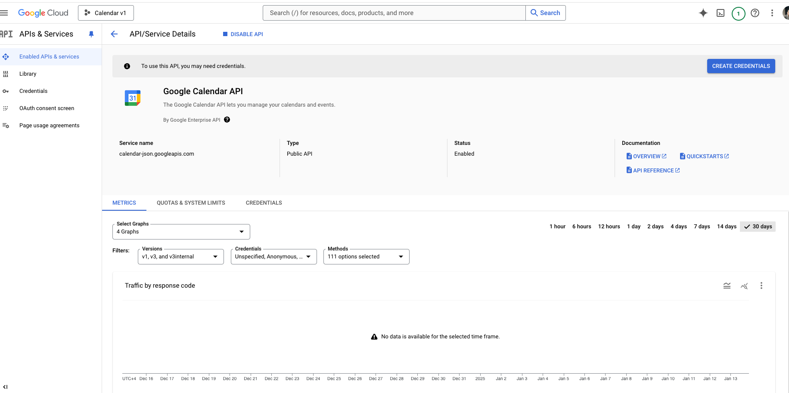
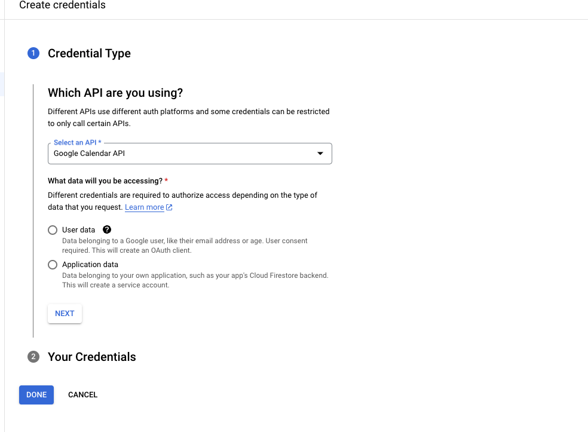
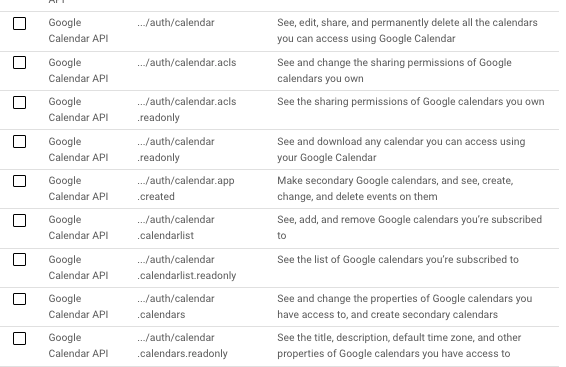
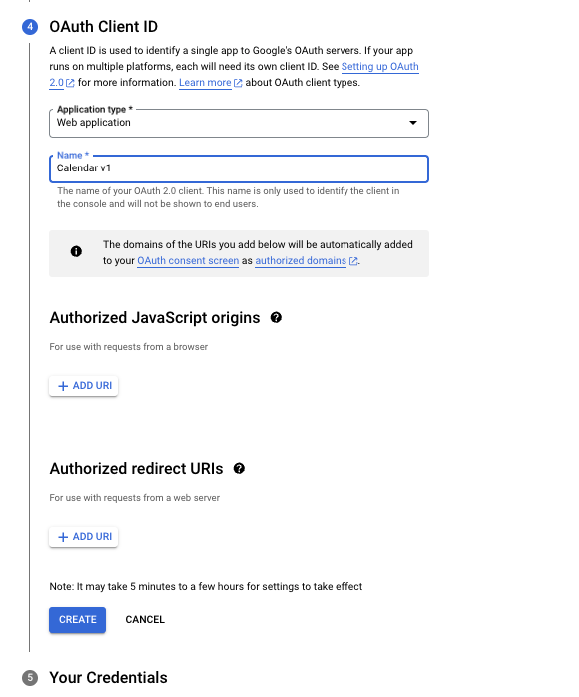
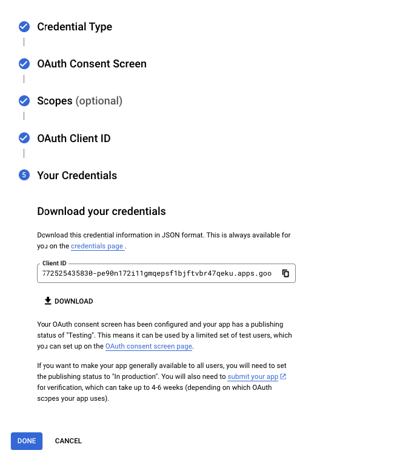

На основе предоставленного изображения вы уже включили Google Calendar API в Google Cloud Console. Это отличный первый шаг. Далее вам нужно выполнить следующие шаги для интеграции с Google Calendar API на языке Go.

---

### 1. **Создать учетные данные (Credentials)**

1. Нажмите на кнопку **"CREATE CREDENTIALS"** на странице API.
2. Выберите **OAuth 2.0 Client ID**:
   - Если потребуется настроить экран согласия (OAuth consent screen), заполните обязательные поля: название приложения, адрес электронной почты и т.д.
3. Укажите, что ваше приложение является **"Web application"**.
4. Добавьте `Redirect URI` (например, `http://localhost:8080/oauth2callback`) для обработки успешного входа.
5. Сохраните созданные учетные данные (JSON-файл). Этот файл понадобится для вашей программы на Go.

---

### 2. **Настроить зависимости в Go**

В вашем проекте нужно использовать библиотеку Google API Client для Go. Установите её через `go mod`:

```bash
go get -u google.golang.org/api/calendar/v3
go get -u golang.org/x/oauth2
go get -u golang.org/x/oauth2/google
```

---

### 3. **Написать код для подключения к API**

Пример кода для подключения и чтения событий из Google Calendar:

```go
package main

import (
 "context"
 "encoding/json"
 "fmt"
 "log"
 "net/http"
 "os"

 "golang.org/x/oauth2"
 "golang.org/x/oauth2/google"
 "google.golang.org/api/calendar/v3"
)

// Загружаем учетные данные из файла
func getClient(config *oauth2.Config) *http.Client {
 tokFile := "token.json" // Файл для хранения токена
 tok, err := tokenFromFile(tokFile)
 if err != nil {
  tok = getTokenFromWeb(config)
  saveToken(tokFile, tok)
 }
 return config.Client(context.Background(), tok)
}

// Загружаем токен из файла
func tokenFromFile(file string) (*oauth2.Token, error) {
 f, err := os.Open(file)
 if err != nil {
  return nil, err
 }
 defer f.Close()
 tok := &oauth2.Token{}
 err = json.NewDecoder(f).Decode(tok)
 return tok, err
}

// Получаем токен через веб
func getTokenFromWeb(config *oauth2.Config) *oauth2.Token {
 authURL := config.AuthCodeURL("state-token", oauth2.AccessTypeOffline)
 fmt.Printf("Перейдите по ссылке для авторизации: \n%v\n", authURL)

 var authCode string
 if _, err := fmt.Scan(&authCode); err != nil {
  log.Fatalf("Не удалось прочитать код авторизации: %v", err)
 }

 tok, err := config.Exchange(context.TODO(), authCode)
 if err != nil {
  log.Fatalf("Не удалось получить токен: %v", err)
 }
 return tok
}

// Сохраняем токен в файл
func saveToken(path string, token *oauth2.Token) {
 fmt.Printf("Сохраняем файл токена в %s\n", path)
 f, err := os.Create(path)
 if err != nil {
  log.Fatalf("Не удалось сохранить токен: %v", err)
 }
 defer f.Close()
 json.NewEncoder(f).Encode(token)
}

func main() {
 // Загружаем учетные данные из JSON
 b, err := os.ReadFile("credentials.json") // Ваш файл с учетными данными
 if err != nil {
  log.Fatalf("Не удалось прочитать credentials.json: %v", err)
 }

 // Настраиваем OAuth2
 config, err := google.ConfigFromJSON(b, calendar.CalendarReadonlyScope)
 if err != nil {
  log.Fatalf("Не удалось создать config: %v", err)
 }

 client := getClient(config)

 // Подключаемся к Calendar API
 srv, err := calendar.NewService(context.Background(), option.WithHTTPClient(client))
 if err != nil {
  log.Fatalf("Не удалось подключиться к Calendar API: %v", err)
 }

 // Получаем список событий
 t := calendar.NewEventsService(srv).List("primary").SingleEvents(true).OrderBy("startTime")
 events, err := t.Do()
 if err != nil {
  log.Fatalf("Не удалось получить события: %v", err)
 }

 // Выводим события
 fmt.Println("Upcoming events:")
 if len(events.Items) == 0 {
  fmt.Println("No events found.")
 } else {
  for _, item := range events.Items {
   date := item.Start.DateTime
   if date == "" {
    date = item.Start.Date
   }
   fmt.Printf("%s (%s)\n", item.Summary, date)
  }
 }
}
```

---

### 4. **Основные моменты**

1. **Файл `credentials.json`**:
   - Этот файл вы скачиваете при создании учетных данных (шаг 1).
   - Разместите его в корне вашего проекта.

2. **Файл `token.json`**:
   - Этот файл создается автоматически после успешной авторизации пользователя.
   - Он используется для хранения токена доступа, чтобы не запрашивать его каждый раз.

3. **Scopes**:
   - В коде указан `calendar.CalendarReadonlyScope`, который позволяет только читать события.
   - Для записи используйте `calendar.CalendarScope`.

---

### 5. **Тестирование**

1. Запустите приложение.
2. Перейдите по ссылке, которая появится в консоли, чтобы авторизоваться через Google.
3. Скопируйте код авторизации и вставьте его в консоль.
4. Приложение выведет список ближайших событий.

---

### 6. **Оптимизация и улучшение**

- Обработайте ошибки в случае недоступности токена или API.
- Добавьте возможность работы с несколькими календарями (не только `primary`).
- Сохраните переменные окружения (например, пути к файлам) в `.env`.

Если появятся вопросы или потребуется помощь с кодом, дайте знать!



На данном экране вам нужно выбрать, какой тип данных вы будете получать через API Google Calendar. Вот пояснение:

1. **User data** (Данные пользователя):
   - Выбирайте этот вариант, если ваше приложение будет получать доступ к личным данным пользователей, например, их календарям.
   - Это подходящий вариант для приложений, которые требуют авторизации пользователя через OAuth 2.0.
   - Вы будете перенаправлять пользователей на экран авторизации Google, и после их согласия получите доступ к данным их календаря.

2. **Application data** (Данные приложения):
   - Этот вариант используется, если вы хотите работать с данными, принадлежащими вашему приложению (например, данными, связанными с вашим сервисным аккаунтом, но не с данными конкретных пользователей).
   - Выбирайте этот вариант, если не нужен доступ к личным данным пользователей, а требуется работа с общими ресурсами приложения.

---

### Что выбрать?

- Если ваше приложение работает **от имени пользователей** и получает доступ к их личным календарям, выбирайте **User data**.
- Если вы создаёте приложение для работы с общими данными (например, корпоративным календарём через сервисный аккаунт), выбирайте **Application data**.

---

### Ваш случай

Скорее всего, вам нужно выбрать **User data**, так как приложение подключается к календарям пользователей. После этого:

1. Нажмите **Next**.
2. Настройте экран согласия (OAuth Consent Screen).
3. Скачайте сгенерированный файл `credentials.json`, который потребуется в вашем коде.

Если вы сомневаетесь, уточните задачу — я помогу!


На данном экране вам нужно добавить **Scopes** (области доступа), которые определяют, какие разрешения ваше приложение запрашивает у пользователей. Для работы с Google Calendar выберите нужные области доступа.

---

### Что делать

1. Нажмите кнопку **"ADD OR REMOVE SCOPES"** (Добавить или удалить области доступа).
2. Добавьте следующие области доступа в зависимости от ваших целей:

#### Основные области для работы с Google Calendar

- **`https://www.googleapis.com/auth/calendar`**  
  Полный доступ к календарям пользователя (чтение и запись).
  
- **`https://www.googleapis.com/auth/calendar.readonly`**  
  Только чтение данных календаря пользователя.

---

### Как выбрать

- Если ваше приложение будет **только читать события** (например, отображать их пользователю), выбирайте `calendar.readonly`.
- Если приложение будет **создавать, изменять или удалять события**, выбирайте `calendar`.

После добавления нажмите **SAVE AND CONTINUE** (Сохранить и продолжить).

---

Если вам нужно больше помощи с конкретными настройками, уточните!



Для вашего приложения, в зависимости от того, что оно должно делать, выбирайте соответствующий **scope (область доступа)**:

### Основные варианты

1. **`.../auth/calendar`**
   - Полный доступ ко всем календарям (чтение, запись, удаление).
   - Выберите, если приложение должно создавать или редактировать события в календаре пользователя.

2. **`.../auth/calendar.readonly`**
   - Доступ только для чтения (нельзя изменять или удалять данные).
   - Выберите, если приложение только показывает данные пользователю.

### Дополнительные (если нужны)

- **`.../auth/calendar.calendarlist`**
  - Позволяет видеть и управлять списком календарей пользователя.
  - Выберите, если нужно, чтобы приложение отображало список всех календарей, а не только события.

- **`.../auth/calendar.calendarlist.readonly`**
  - Только чтение списка календарей (без возможности управлять).

- **`.../auth/calendar.app.created`**
  - Управление только вторичными календарями, созданными приложением.

---

### Ваш выбор

- Если приложение должно **управлять событиями (добавлять, редактировать, удалять)**: выберите **`.../auth/calendar`**.
- Если приложение только **отображает события**: выберите **`.../auth/calendar.readonly`**.
- Для базового функционала обычно достаточно одного из этих двух.

После выбора нажмите **SAVE AND CONTINUE** (Сохранить и продолжить).



На этом этапе вы создаете **OAuth Client ID** для вашего приложения. Вот что вам нужно сделать:

---

### 1. **Application type (Тип приложения)**

- Убедитесь, что выбран **Web application** (Веб-приложение), так как вы работаете с серверным приложением.

---

### 2. **Name (Название)**

- Укажите удобное имя для вашего клиента, например, **Calendar v1**.
- Это название используется только внутри Google Cloud Console для идентификации.

---

### 3. **Authorized JavaScript origins (Доверенные источники JavaScript)**

- Если ваше приложение использует JavaScript в браузере, добавьте здесь домен вашего приложения. Например:

  ```
  http://localhost:8080
  ```

- В вашем случае, если приложение только серверное (без фронтенда), этот раздел можно оставить пустым.

---

### 4. **Authorized redirect URIs (Доверенные URI перенаправления)**

- Это важно! Добавьте URI, на который Google перенаправит пользователя после авторизации.
- Для локальной разработки добавьте:

  ```
  http://localhost:8080/oauth2callback
  ```

- Если вы будете развертывать приложение на сервере, добавьте соответствующий домен, например:

  ```
  https://ваш-домен/oauth2callback
  ```

---

### 5. **Создание**

- После заполнения всех данных нажмите **CREATE**.
- Вы получите JSON-файл с вашими клиентскими учетными данными (`credentials.json`), который нужно сохранить.

---

Если нужно дополнительное разъяснение или помощь с интеграцией, дайте знать!



Отлично! На этом шаге вы успешно завершили создание учетных данных (OAuth Client ID). Вот что делать дальше:

---

Ошибка `403: access_denied` возникает из-за того, что ваше приложение находится в **режиме тестирования**, и ваш аккаунт Google не добавлен в список тестировщиков.

---

### Как исправить

#### 1. **Добавьте свой аккаунт в список тестировщиков**

1. Перейдите в **Google Cloud Console**:
   - Выберите проект вашего приложения.
   - Откройте вкладку **OAuth consent screen** (Экран согласия OAuth).

2. В разделе **Test users** (Тестовые пользователи):
   - Нажмите кнопку **Add users** (Добавить пользователей).
   - Укажите адрес электронной почты Google, который вы используете.

3. Сохраните изменения.

После этого вы сможете пройти процесс авторизации через указанное приложение.

---

#### 2. **Убедитесь, что вы используете правильный аккаунт**

Если у вас несколько аккаунтов Google, убедитесь, что вы авторизуетесь с того, который добавлен в список тестировщиков.

---

#### 3. **Перевод приложения в продакшн (опционально)**

Если приложение должно быть доступно всем пользователям:

1. В разделе **OAuth consent screen** установите статус **Publishing status** в **In Production**.
2. Учтите, что если вы используете чувствительные или ограниченные области доступа (scopes), потребуется отправить приложение на проверку Google. Это может занять до 4-6 недель.

---

### Проверка

После добавления вашего аккаунта в список тестировщиков повторите авторизацию через ссылку, которую предоставляет ваше приложение. Ошибка должна исчезнуть. Если проблема сохраняется, напишите, я помогу разобраться!

Ошибки, которые вы видите, указывают на то, что необходимые зависимости не установлены в вашем проекте. Вот как исправить эту проблему:

---

## **Инициализация модуля Go**

### 1. **Инициализация модуля Go**

Если вы еще не инициализировали модуль Go, сделайте это:

```bash
go mod init your-module-name
```

Это создаст файл `go.mod`, который будет управлять зависимостями вашего проекта.

---

### 2. **Добавление зависимостей**

Вам нужно установить отсутствующие пакеты. Для этого выполните следующие команды в терминале:

```bash
go get golang.org/x/oauth2
go get golang.org/x/oauth2/google
go get google.golang.org/api/calendar/v3
```

Эти команды:

- Скачивают необходимые библиотеки.
- Добавляют их в файл `go.mod` для автоматического управления версиями.

---

### 3. **Проверка корректности установки**

После установки зависимости должны быть указаны в файле `go.mod`. Проверьте его, чтобы убедиться, что пакеты добавлены `cat go.mod`:

```go
require (
    golang.org/x/oauth2 v0.0.0-... # Версия может отличаться
    golang.org/x/oauth2/google v0.0.0-...
    google.golang.org/api v0.0.0-...
)
```

---

### 4. **Запуск программы**

Теперь вы можете снова запустить свою программу:

```bash
go run task_test_func.go
```

---

### Если ошибки сохраняются

Если все еще возникают проблемы:

1. Убедитесь, что у вас есть подключение к интернету, чтобы Go мог загрузить зависимости.
2. Убедитесь, что Go установлен корректно, и его версия поддерживает модули (Go 1.11+).

Если возникнут дополнительные вопросы, напишите!

## `credentials.json`

### 1. **Скачайте файл учетных данных**

- Нажмите **DOWNLOAD**, чтобы сохранить файл с клиентскими учетными данными (`credentials.json`).
- Поместите этот файл в корневую директорию вашего Go-проекта, так как он понадобится для подключения к Google Calendar API.

---

### 2. **Использование файла `credentials.json`**

В вашем Go-приложении вам нужно будет загрузить этот файл, чтобы настроить клиентскую авторизацию. Вот пример кода, как это сделать:

#### Код для загрузки учетных данных

```go
package main

import (
 "context"
 "encoding/json"
 "fmt"
 "log"
 "net/http"
 "os"

 "golang.org/x/oauth2"
 "golang.org/x/oauth2/google"
 "google.golang.org/api/calendar/v3"
 "google.golang.org/api/option"
)

// Функция для получения клиента с авторизацией
func getClient(config *oauth2.Config) *http.Client {
 tokFile := "token.json"
 tok, err := tokenFromFile(tokFile)
 if err != nil {
  tok = getTokenFromWeb(config)
  saveToken(tokFile, tok)
 }
 return config.Client(context.Background(), tok)
}

// Чтение токена из файла
func tokenFromFile(file string) (*oauth2.Token, error) {
 f, err := os.Open(file)
 if err != nil {
  return nil, err
 }
 defer f.Close()
 tok := &oauth2.Token{}
 err = json.NewDecoder(f).Decode(tok)
 return tok, err
}

// Получение токена через веб
func getTokenFromWeb(config *oauth2.Config) *oauth2.Token {
 authURL := config.AuthCodeURL("state-token", oauth2.AccessTypeOffline)
 fmt.Printf("Перейдите по ссылке для авторизации:\n%v\n", authURL)

 var authCode string
 if _, err := fmt.Scan(&authCode); err != nil {
  log.Fatalf("Не удалось прочитать код авторизации: %v", err)
 }

 tok, err := config.Exchange(context.TODO(), authCode)
 if err != nil {
  log.Fatalf("Не удалось получить токен: %v", err)
 }
 return tok
}

// Сохранение токена в файл
func saveToken(path string, token *oauth2.Token) {
 fmt.Printf("Сохранение файла токена в: %s\n", path)
 f, err := os.Create(path)
 if err != nil {
  log.Fatalf("Не удалось сохранить токен: %v", err)
 }
 defer f.Close()
 json.NewEncoder(f).Encode(token)
}

func main() {
 // Загрузка учетных данных из файла
 b, err := os.ReadFile("credentials.json")
 if err != nil {
  log.Fatalf("Не удалось прочитать credentials.json: %v", err)
 }

 // Настройка OAuth2 конфигурации
 config, err := google.ConfigFromJSON(b, calendar.CalendarReadonlyScope)
 if err != nil {
  log.Fatalf("Не удалось настроить OAuth2: %v", err)
 }

 // Получение клиента с авторизацией
 client := getClient(config)

 // Использование Google Calendar API
 srv, err := calendar.NewService(context.Background(), option.WithHTTPClient(client))
 if err != nil {
  log.Fatalf("Не удалось подключиться к Google Calendar API: %v", err)
 }

 // Получение списка событий из календаря
 events, err := srv.Events.List("primary").MaxResults(10).OrderBy("startTime").SingleEvents(true).Do()
 if err != nil {
  log.Fatalf("Не удалось получить события: %v", err)
 }

 if len(events.Items) == 0 {
  fmt.Println("События не найдены.")
  return
 }

 fmt.Println("Список событий:")
 for _, item := range events.Items {
  date := item.Start.DateTime
  if date == "" {
   date = item.Start.Date
  }
  fmt.Printf("%s: %s\n", date, item.Summary)
 }
}

```

---

### 3. **Тестирование авторизации**

При первом запуске приложения:

1. Приложение выведет ссылку для авторизации.
2. Перейдите по этой ссылке, войдите в Google и предоставьте доступ к данным.
3. Введите полученный код авторизации в консоль, чтобы приложение завершило процесс OAuth.

---

### 4. **Режим "Testing"**

Ваше приложение сейчас находится в статусе **"Testing"**. Это означает:

- Оно доступно только для ограниченного числа тестовых пользователей (указанных на экране OAuth Consent Screen).
- Вы можете добавить тестовые учетные записи (адреса Gmail) в разделе **OAuth Consent Screen**.

Если вы хотите, чтобы ваше приложение было доступно для всех пользователей, нужно:

1. Перевести приложение в статус **"In Production"**.
2. Отправить его на модерацию в Google.

---

Если у вас есть вопросы по интеграции или настройке, дайте знать!
