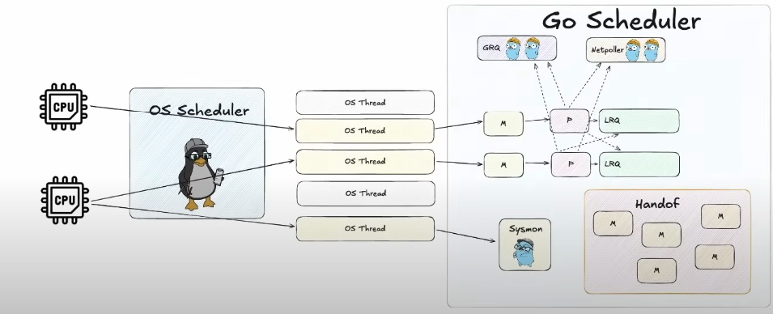

# 🧠 Полный конспект планировщика Go для начинающих (по видео Николая Тузова)

[ссылка на видео](https://www.youtube.com/watch?v=kedW1xO3Zbo&t)  
[ссылка на текстовую версию видео](https://habr.com/ru/articles/891426/)

## 1. 🤔 Основные проблемы, которые решает планировщик

**Представьте ситуацию:** У вас есть ресторан (ваша программа), куда одновременно может прийти много клиентов (задачи программы), но у вас ограниченное количество поваров (ядра процессора). Как организовать работу эффективно? 🍳

**Проблемы традиционного подхода:**

- 💰 Создание отдельного повара (системного потока) для каждого клиента — слишком затратно
- 🔄 Много поваров будут мешать друг другу на кухне (контекстное переключение)
- ⏳ Некоторые заказы требуют ожидания (например, запекание в духовке) — нерационально, чтобы повар просто стоял и ждал

## 2. 🧩 Компоненты планировщика Go (детальное описание)

### 🐹 Горутины (G)

- **Что это:** легковесные единицы работы, созданные, когда вы пишете `go func()`
- **Размер:** всего ~2 КБ в памяти (обычный поток ОС занимает ~1 МБ — в 500 раз больше!) 📏
- **Состояния:**
  - **Waiting** ⏱️ — ждет какого-то события (например, данных из сети)
  - **Runnable** 🏁 — готова к выполнению, ждет свободного процессора
  - **Executing** ⚡ — активно выполняется на процессоре
- **Аналогия:** Горутина — как список задач для одного клиента в ресторане 📋

### 🔧 Машина (M) — системный поток ОС

- **Что это:** реальный исполнитель, предоставляемый операционной системой
- **Особенности:**
  - 💸 Создание и уничтожение потоков — "дорогая" операция
  - 1️⃣ В один момент времени поток может выполнять только одну горутину
  - 🚫 Количество потоков ограничено системными ресурсами
- **Аналогия:** Поток — как повар, который физически готовит блюда 👨‍🍳

### 🎛️ Процессор (P)

- **Что это:** виртуальный процессор, связующее звено между горутинами и потоками
- **Функции:**
  - 📑 Имеет свою локальную очередь задач (LRQ)
  - 🔗 Привязывается к потоку M для выполнения горутин
  - 🔢 Количество P обычно равно количеству ядер CPU
- **Аналогия:** Процессор — как рабочая станция на кухне, где повар готовит определенные блюда 🍽️

### 📝 Очереди задач

- **Локальная очередь (LRQ):**
  - 🏠 Принадлежит конкретному процессору P
  - 📦 Содержит горутины, готовые к выполнению
  - ⚡ Быстрый доступ, минимальная синхронизация
- **Глобальная очередь (GRQ):**
  - 🌍 Общая для всех процессоров
  - 🔒 Защищена мьютексом (механизм синхронизации)
  - 🆘 Используется, когда локальные очереди переполнены или пусты
- **Аналогия:** LRQ — как список заказов на конкретной станции, GRQ — как общая доска заказов 📊

## 3. 📈 Эволюция планировщика (пошагово)

### 1️⃣ Модель 1:1 (наивное решение)

- 👨‍🍳➡️👤 Для каждой новой горутины создается новый поток ОС
- **Проблема:** 😱 слишком затратно, ограниченная масштабируемость
- **Аналогия:** Нанимать нового повара для каждого клиента — невыгодно 💸

### 🔄 Пул потоков (первое улучшение)

- ♻️ Вместо создания/уничтожения потоков — их повторное использование
- 🔙 Освободившиеся потоки возвращаются в пул для будущих задач
- **Аналогия:** Повара не уходят после выполнения заказа, а берут следующий заказ из очереди 👨‍🍳➡️📋

### 📊 Модель M:N (ключевое решение)

- M горутин выполняются на N потоках ОС
- 🎯 Количество потоков примерно равно количеству ядер процессора
- **Аналогия:** Фиксированное количество поваров обслуживает множество заказов 👨‍🍳👨‍🍳👨‍🍳 ➡️ 📋📋📋📋📋📋

### 🏠 Локальные очереди (LRQ) для каждого P

- 🔖 Каждый процессор имеет свою очередь горутин
- 👍 Минимизирует конкуренцию за доступ к очереди
- **Аналогия:** Каждый повар имеет собственный список заказов на своей станции 📋👨‍🍳

### 🕵️ Механизм кражи работы (Work Stealing)

- 🤝 Если процессор P1 не имеет задач, он может "украсть" их у другого процессора P2
- 🧮 Обычно крадется половина очереди для баланса
- **Аналогия:** Если у одного повара нет заказов, он может взять часть заказов у занятого коллеги 👀📋

---

## 4. 🛠️ Специальные механизмы планировщика

### 🔄 1. Handoff (передача управления)

#### Для чего нужен

- 🚧 Решает проблему **блокирующих системных вызовов**
- 🔍 Предотвращает простаивание процессора, когда горутина заблокирована
- 🚀 Позволяет другим горутинам продолжать выполнение

#### Как работает

1. 📱 Горутина G1 выполняет блокирующий системный вызов (например, чтение с диска)
2. 🔌 Процессор P отсоединяется от текущего потока M1
3. 🆕 Берется новый/свободный поток M2 из пула потоков
4. 🔄 P присоединяется к M2 и продолжает выполнять другие горутины (G2, G3...)
5. ⏱️ M1 с G1 ждет завершения системного вызова
6. ✅ Когда системный вызов завершается, G1 помещается обратно в очередь задач

#### Понятный пример

Представьте кассира в магазине (поток M1), обслуживающего клиента (горутина G1). Клиенту нужно сходить в машину за кошельком (блокирующая операция). Вместо того чтобы простаивать, кассир переходит к другой кассе (новый поток M2) и обслуживает других клиентов. Когда первый клиент возвращается, он встает в очередь и будет обслужен, когда дойдет его черед.

---

### 📡 2. Network Poller (сетевой опрашиватель)

#### Для чего нужен

- 📊 Эффективная обработка **сетевых операций ввода-вывода**
- 💪 Предотвращает блокировку потоков при ожидании данных из сети
- 🚀 Позволяет запускать тысячи одновременных сетевых соединений

#### Как работает

1. 🕸️ Горутина G выполняет сетевую операцию (например, HTTP-запрос)
2. 📝 Вместо блокировки, операция регистрируется в Network Poller
3. 🔄 Горутина G переводится в состояние Waiting и освобождает процессор P
4. 🔍 Network Poller (работает в отдельном потоке) проверяет готовность сетевых операций
5. 🔔 Когда данные получены, Poller уведомляет планировщик
6. 🏁 Горутина G переводится в состояние Runnable и возвращается в очередь

#### Понятный пример

Представьте повара (горутина), которому нужны ингредиенты из склада (сеть). Вместо того чтобы самому идти на склад (блокироваться), он отправляет заявку (записывается в Poller) и переключается на другие задачи. Специальный работник (Poller) следит за поступлением всех заказанных ингредиентов. Когда ингредиенты привозят, работник сообщает повару, и тот возвращается к приготовлению.

---

### 🤝 3. Кооперативная многозадачность

#### Для чего нужна

- ⚖️ Обеспечивает **баланс времени выполнения** между горутинами
- 🤔 Дает горутинам возможность самостоятельно решать, когда уступить процессор
- 💡 Более предсказуемое поведение, чем принудительное вытеснение

#### Как работает

1. 🕐 Горутина выполняется на процессоре P определенное время
2. 🔍 В определенных "точках проверки" горутина проверяет флаг `stackGuard`
3. ✅ Если флаг установлен в `stackPreempt`, горутина добровольно покидает процессор
4. 🔄 Планировщик выбирает следующую горутину для выполнения

#### Когда происходят проверки

- 📞 При вызове функций (безопасно сохранить контекст)
- 🔒 При выполнении блокирующих операций
- 🔄 При входе в новую итерацию цикла for

#### Понятный пример

Это как совещание, где каждый участник (горутина) говорит какое-то время, а затем сам решает, что пора дать слово другим. Участники проверяют, не пора ли передать слово, когда заканчивают мысль или наступает логическая пауза в их речи.

---

### 👮 4. Принудительное вытеснение (с Go 1.14)

#### Для чего нужно

- 🦁 Решает проблему "жадных" горутин, которые **не уступают процессор**
- ⚠️ Предотвращает ситуации, когда одна горутина блокирует всю программу
- ⚡ Обеспечивает отзывчивость программы даже при интенсивных вычислениях

#### Как работает

1. ⏱️ Sysmon (системный монитор) периодически проверяет время выполнения горутин
2. 🚨 Если горутина выполняется более 10мс без проверки `stackGuard`, Sysmon принимает меры
3. 📢 Отправляется сигнал SIGURG потоку M, выполняющему "жадную" горутину
4. 🛑 Обработчик сигнала устанавливает флаг `stackGuard=stackPreempt`
5. 🔄 При следующей проверке (или немедленно) горутина будет вытеснена

#### Понятный пример

Представьте участника совещания, который говорит без остановки (горутина в бесконечном цикле). Если он не делает пауз, чтобы проверить, не пора ли дать слово другим, модератор (Sysmon) может прервать его, подав сигнал (SIGURG). Это обеспечивает, что все участники получат возможность высказаться.

---

### 🔄 5. Work Stealing (кража работы)

#### Для чего нужен

- ⚖️ Обеспечивает **равномерное распределение нагрузки** между процессорами
- 🚫 Предотвращает ситуации, когда одни процессоры простаивают, а другие перегружены
- 🚀 Повышает общую производительность системы

#### Как работает

1. 🔍 Процессор P1 завершил все свои горутины и его LRQ пуста
2. 🔎 P1 проверяет глобальную очередь GRQ (с вероятностью 1/61 при каждой итерации)
3. 🕵️ Если GRQ тоже пуста, P1 пытается "украсть" горутины у другого процессора P2
4. 🤝 Обычно P1 забирает примерно половину горутин из LRQ процессора P2
5. 🔄 Таким образом, работа равномерно распределяется между всеми процессорами

#### Понятный пример

Представьте, что в ресторане один повар освободился (процессор P1), а у другого скопилось много заказов (процессор P2 с большой LRQ). Вместо простоя первый повар берет половину заказов у загруженного коллеги. Это обеспечивает, что все клиенты будут обслужены быстрее.

---

### 📱 6. Sysmon (системный монитор)

#### Для чего нужен

- 🔍 **Фоновый мониторинг** состояния планировщика
- ⏱️ Отслеживание длительно выполняющихся горутин
- 🔄 Проверка заблокированных системных вызовов
- 📊 Периодическое обслуживание планировщика

#### Как работает

1. 🏃 Запускается в отдельном потоке M, не привязанном к процессору P
2. 🔄 Периодически просыпается (примерно каждые 10мс)
3. 🔍 Проверяет:
   - Не выполняется ли какая-то горутина слишком долго (для принудительного вытеснения)
   - Не завис ли какой-то системный вызов (для handoff)
   - Не пора ли проверить Network Poller
4. 🛠️ Выполняет необходимые действия по результатам проверок

#### Понятный пример

Sysmon похож на менеджера ресторана, который периодически обходит кухню и проверяет: не готовит ли кто-то блюдо слишком долго, не ждет ли повар чего-то, что можно ускорить, не нужно ли перераспределить задачи. Он не готовит сам, но обеспечивает эффективную работу всей кухни.

---

### 🤔 Как все эти механизмы работают вместе?

1. **Handoff и Network Poller** дополняют друг друга:
   - Network Poller обрабатывает сетевые операции неблокирующим способом
   - Handoff обрабатывает другие блокирующие системные вызовы, для которых нет асинхронного API

2. **Кооперативная и принудительная многозадачность** образуют двухуровневую защиту:
   - В обычной ситуации горутины сами уступают процессор (кооперативно)
   - Если горутина не уступает, срабатывает принудительное вытеснение

3. **Work Stealing и Sysmon** обеспечивают оптимизацию:
   - Work Stealing балансирует нагрузку между процессорами
   - Sysmon следит за общим состоянием и решает проблемы

---

## 5. 📊 Сравнение механизмов планировщика

| Механизм | Когда используется | Преимущества | Особенности |
|----------|-------------------|-------------|------------|
| 🔄 **Handoff** | При блокирующих системных вызовах | Процессор не простаивает | Создает дополнительные потоки |
| 📡 **Network Poller** | При сетевых операциях ввода-вывода | Масштабируемость до тысяч соединений | Работает только с сетевыми операциями |
| 🤝 **Кооперативная многозадачность** | В обычном режиме работы | Низкие накладные расходы, предсказуемость | Зависит от добросовестности горутин |
| 👮 **Принудительное вытеснение** | Когда горутина не уступает | Предотвращает блокировку системы | Небольшие накладные расходы |
| 🔄 **Work Stealing** | При неравномерной нагрузке | Оптимальное использование ресурсов | Небольшие накладные расходы на синхронизацию |
| 📱 **Sysmon** | Постоянно в фоновом режиме | Общий мониторинг и обслуживание | Минимальное потребление ресурсов |

## 6. 🔄 Практический пример работы планировщика

Представьте, что у вас программа, которая:

1. 📥 Скачивает файлы из интернета
2. 🔧 Обрабатывает их
3. 💾 Сохраняет результаты

**Как это работает с планировщиком Go:**

1. 🚀 Вы создаете горутины для каждой загрузки: `go downloadFile(url)`
2. 🧩 Планировщик распределяет эти горутины по процессорам P
3. 📡 Когда горутина ожидает данные из сети:
   - ✍️ Она регистрируется в Network Poller
   - ⏭️ Процессор P начинает выполнять другую горутину из очереди
4. 📨 Когда данные из сети получены:
   - 🔔 Network Poller уведомляет планировщик
   - 🏁 Горутина загрузки становится Runnable и возвращается в очередь
5. ▶️ Когда горутина загрузки возобновляется:
   - 🆕 Она создает новую горутину для обработки: `go processFile(data)`
6. 🔄 Планировщик эффективно распределяет все эти горутины на доступные процессоры

**Результат:** 🎉 вы можете одновременно загружать и обрабатывать множество файлов, эффективно используя ресурсы компьютера, без необходимости вручную управлять потоками.

---

## 7. 🏆 Преимущества планировщика Go

1. **Эффективность:** 💪 минимальное использование системных ресурсов
2. **Масштабируемость:** 📈 легко создавать тысячи горутин
3. **Простота для программиста:** 😌 не нужно вручную управлять потоками
4. **Производительность:** ⚡ автоматическая балансировка нагрузки
5. **Отзывчивость:** 🔄 предотвращение "зависания" программы из-за длительных операций

---

## 8. 💡 Ключевые выводы

1. **Планировщик Go** — это умная система, которая позволяет миллионам легковесных горутин эффективно работать на ограниченном количестве ядер процессора.

2. **Основные компоненты** (G, M, P) работают вместе, чтобы обеспечить оптимальное использование ресурсов системы:
   - **Горутины (G)** — легковесные единицы работы
   - **Машины (M)** — системные потоки, которые фактически выполняют код
   - **Процессоры (P)** — связующее звено между горутинами и потоками

3. **Специальные механизмы планировщика** решают конкретные проблемы:
   - **Handoff и Network Poller** — для обработки блокирующих операций
   - **Кооперативная и принудительная многозадачность** — для справедливого разделения процессорного времени
   - **Work Stealing и Sysmon** — для общей оптимизации и мониторинга

4. **В результате** программист получает простую модель конкурентности (`go` ключевое слово), в то время как планировщик заботится о сложностях эффективного выполнения.

