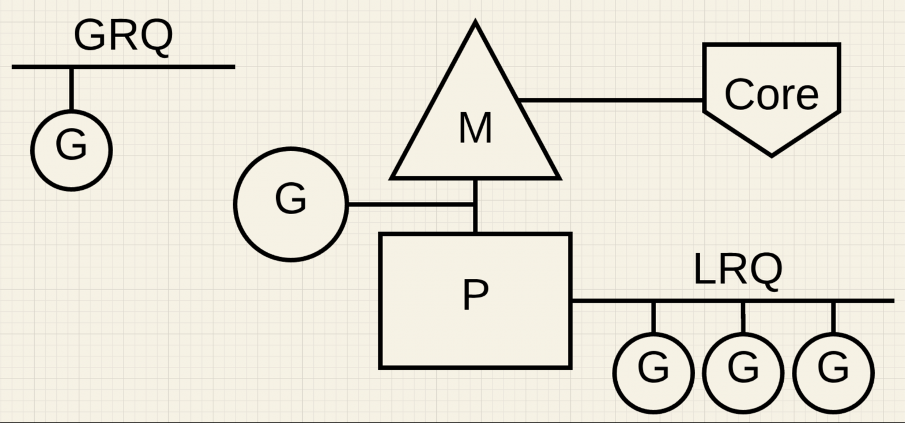
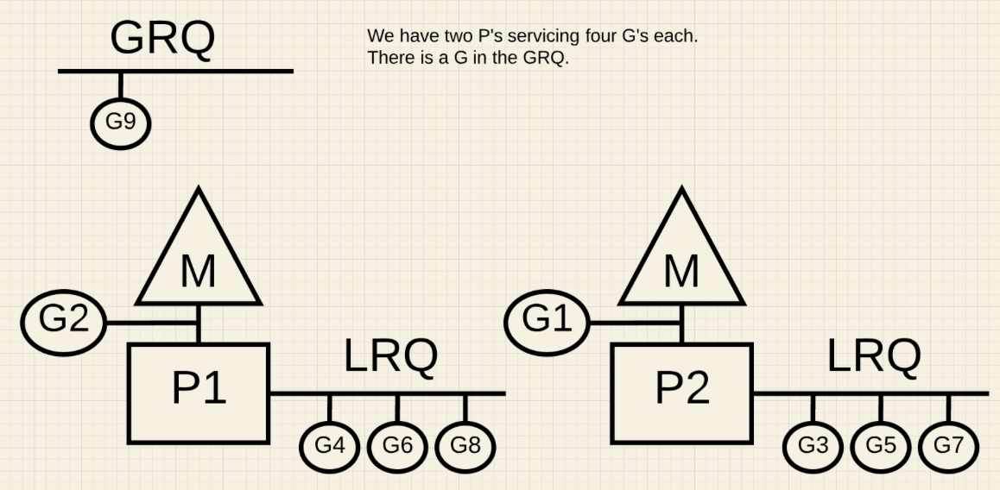
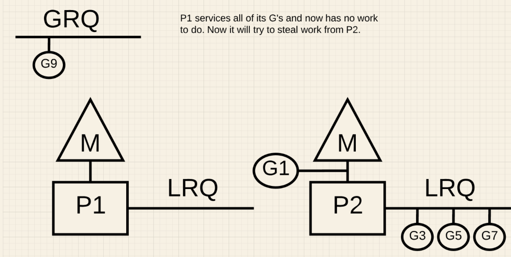
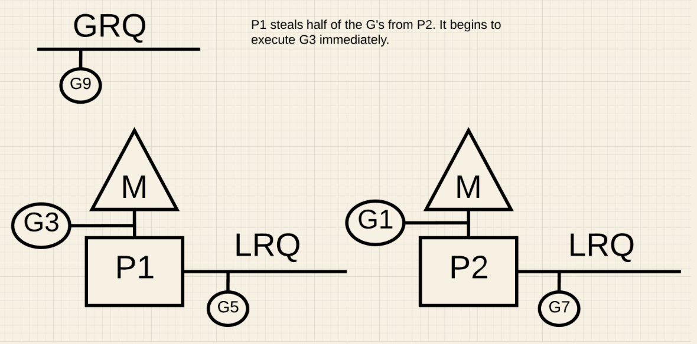
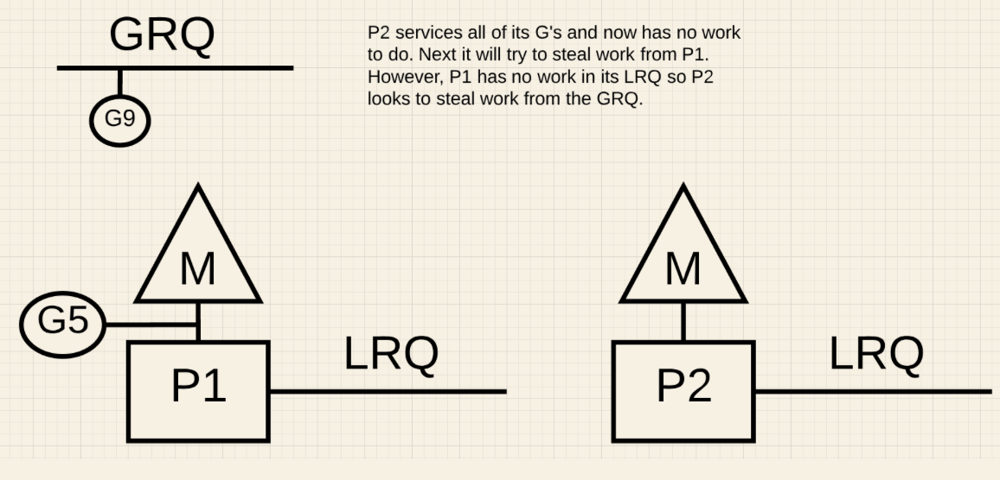
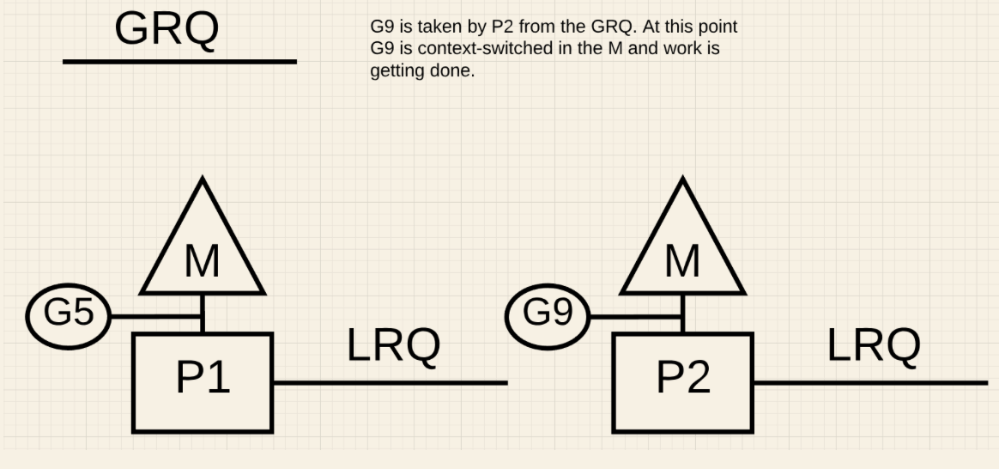

# Scheduler Go. Простыми словами

Видео материалы:

- [Планировщик Go — самый подробный гайд простым языком](https://www.youtube.com/watch?v=kedW1xO3Zbo)
- [Планировщик в GO - как он устроен](https://www.youtube.com/watch?v=0Eb5KeNQV5E)
- [Секреты внутреннего устройства планировщика Go](https://www.youtube.com/watch?v=P2Tzdg8n9hw)

## Планировщик OS

Каждая программа, которую мы запускаем, создает процесс, и каждому процессу присваивается его начальный поток. У процесса может быть несколько потоков. Все они выполняются независимо друг от друга, и решения о планировании принимаются на уровне потока, а не на уровне процесса. Потоки могут выполняться конкурентно (на одном ядре) или параллельно (каждый из них выполняется одновременно на разных ядрах). Потоки также сохраняют свое собственное состояние, чтобы обеспечить безопасное, локальное и независимое выполнение своих инструкций.  
Планировщик OS отвечает за то, чтобы ядра не простаивали, если есть потоки, которые могут выполняться. Его задача - создавать иллюзию того, что все потоки выполняются одновременно. В процессе создания этой иллюзии планировщик должен запускать потоки с более высоким приоритетом по сравнению с потоками с более низким приоритетом. Однако потоки с более низким приоритетом не должны испытывать недостаток времени выполнения. Планировщик также должен максимально минимизировать задержки планирования, принимая быстрые и разумные решения. Планировщик OS является недетерминированным. Это означает, что мы не можем предсказать, что планировщик собирается делать в тот или иной момент времени.

Вот некоторые важные сущности, с которыми взаимодействует планировщик OS:

- Состояния потоков (Thread States):

  - Waiting. Поток остановлен и ждет чего-то, чтобы продолжить. Это может быть по причинам, связанным с железом (диск), операционной системой (системные вызовы) или с вызовами синхронизаций (атомарные, мьютексы). Эти типы задержек являются основной причиной низкой производительности.

  - Runnable. Потоку требуется время на ядре, чтобы он мог выполнять назначенные ему машинные инструкции. Если у нас много потоков, которым нужно время, то им придется ждать дольше, чтобы получить это время. Кроме того, индивидуальное количество времени, которое получает каждый конкретный поток, сокращается, поскольку большее количество потоков конкурирует за время. Этот тип задержки планирования также может быть причиной низкой производительности.

  - Executing. Поток размещен на ядре и выполняет свои машинные инструкции.

- Типы выполняемой работы (Types Of Work):

  - CPU-Bound. Это работа, которая никогда не создает ситуации, где поток может быть помещен в состояние ожидания. Пример: вычисление числа pi до n-й цифры является CPU-Bound работой.

  - I/O-Bound. Это работа, которая заставляет потоки входить в состояние ожидания. Как пример, работа, которая заключается в запросе доступа к ресурсу по сети или совершении системных вызовов в операционную систему. Поток, которому необходимо получить доступ к базе данных, будет выполнять I/O-Bound работу.

- Переключения контекста (Context Switching). Это физический акт обмена потоками на ядре. Переключение контекста происходит, когда планировщик вытягивает Executing поток из ядра и заменяет его Runnable потоком. Вытащенный поток может вернуться в состояние Runnable (если он все еще может работать) или в состояние Waiting (если он был заменен из-за запроса типа I/O-Bound). Переключение контекста считается дорогой операцией и происходит относительно медленно. Величина задержки, возникающая при переключении контекста, зависит от различных факторов. Если исходить из расчета, что машина выполняет 12 операций в наносекунду, а переключение контекста занимает ~ 1000 до ~ 1500 наносекунд, то мы теряем 12 000 операций и более.  
Если есть программа, ориентированная на работу с I/O-Bound, то переключение контекста будет преимуществом. Как только поток переходит в состояние Waiting, его место занимает другой поток в состоянии Runnable. Это позволяет ядру всегда выполнять работу, и является одним из самых важных аспектов планирования. Если программа сосредоточена на CPU-Bound работе, то переключение контекста станет кошмаром для производительности. Представьте, что у потока есть постоянная работа, и переключение контекста останавливает выполнение этой работы. Эта ситуация резко контрастирует с тем, что происходит с рабочей нагрузкой, связанной с вводом-выводом (I/O-Bound).

## Планировщик Go

Как и в случае с планировщиком OS, мы не можем предсказать работу планировщика Go, так как он также недетерменирован. Это связано с тем, что принятие решений для этого планировщика находится не в руках разработчика, а в руках runtime Go.  
Здесь также перечислим важные сущности, с которыми взаимодействует планировщик Go:

- P, M, G.

  - P (processor) - логический процессор (не железо). Это условный контекст, который объединяет поток операционной системы (M) и очередь горутин. Количество горутин, привязанных к P неограниченно. По умолчанию количество P берётся из значения переменной среды GOMAXPROCS и равно количеству логических ядер компьютера.

  - M (machine thread) - поток OS. Он закреплён за P и имеет с ним отношение один к одному.

  - G (goroutine) - горутина

-Coroutine. Каждой программе Go также дается начальная горутина (G). Goroutine — это, по сути, Coroutine, но это Go, поэтому мы заменяем букву C на G и получаем слово Goroutine. Можно думать о Goroutines как о потоках уровня приложения. Они во многом похожи на потоки ОС: например, точно так же, как потоки ОС включаются и выключаются в зависимости от контекста ядра, горутины включаются и выключаются в зависимости от контекста потока OS (M). Потоки OS располагаются на ядре OS, а горутины располагаются на потоках OS. Своеобразная пирамида.

- Состояния потоков (Thread States). Тут очень много схожего с состояниями потоков OS:

  - Waiting. Горутина остановлена и ожидает чего-то, чтобы продолжить работу. Это может быть по таким причинам, как ожидание операционной системы (системные вызовы) или вызовы синхронизации (атомарные операции и операции с мьютексами). Эти типы задержек являются основной причиной низкой производительности.

  - Runnable: Горутине нужно время на M, чтобы она могла выполнять назначенные инструкции. Если есть много горутин, которым нужно время, то горутины должны ждать дольше, чтобы получить это самое время. Кроме того, индивидуальное количество времени, которое получает каждая горутина, сокращается по мере того, как все больше горутин соревнуются за время. Этот тип задержки планирования также может быть причиной низкой производительности.

  - Running. Горутина была помещена на M и выполняет свои инструкции.

- Переключения контекста (Context Switching). В сравнении с переключением контекста OS, переключение контекста у планировщика GO - более легковесная операция: ~200 наносекунд, при которых мы теряем ~2 400 операций. То есть примерно в пять раз меньше.

- GRQ, LRQ. В планировщике Go есть две разные очереди выполнения: глобальная очередь выполнения (Global Run Queue - GRQ) и локальная очередь выполнения (Local Run Queue - LRQ). Каждому P присваивается LRQ, которая управляет горутинами, назначенными для выполнения на P. Эти горутины по очереди включаются и выключаются в зависимости от контекста M, назначенного этому P.  
GRQ предназначен для горутин, которые еще не были назначены для какого-либо P. Существует процесс перемещения горутин из GRQ в LRQ.
Я внимательно изучил предоставленный текст и сопроводительные изображения. Давайте разберемся в принципах работы планировщика Go и его основных отличиях от планировщика операционной системы.

Теперь объединим все сказанное выше в одну схему:



На рисунке 1 в левом верхнем углу мы видим глобальную очередь горутин (GRQ), в которой на данный момент находится одна горутина. В центре картинки находится поток операционной системы (M), расположенный на ядре (Core), и к этому потоку прикреплен логический процессор (P). Видим, что на данный момент одна горутина находится в состоянии Running, так как она прямо сейчас расположена на потоке операционной системы (M). И видим, что у процессора (P) есть своя локальная очередь горутин (LRQ), на которой располагаются 3 горутины. Их состояние runnable.

### Work stealing

Планировщик GO работает по принципу "кражи работы". Этот принцип помогает балансировать и распределять горутины по соответствующим процессорам (P).



На рисунке 2 мы видим многопоточную Go программу с двумя P, каждый из которых обслуживает по 4 горутины (G). Есть и глобальная очередь (GRQ) с единственной горутиной (G9). Что случится, если на одном из P все горутины закончат свою работу?



На рисунке 3 видно, что у P1 больше нет горутин. Ни в состоянии Running, ни в состоянии Runnable. Однако P2 в своей локальной очереди (LRQ) имеет целых 3 горутины.
P1, чтобы не простаивать, должен будет "украсть" у P2 горутины. Вот алгоритм кражи:

```go
runtime.schedule() {
 // only 1/61 of the time, check the global runnable queue for a G.
 // if not found, check the local queue.
 // if not found,
 // try to steal from other Ps.
 // if not, check the global runnable queue.
 // if not found, poll network.
}
```

Следуя этому алгоритму, P1 должен проверить P2 на наличие у него горутин в LRQ. И при наличии взять половину:



Что мы и видим на рисунке 4(выше).  
Далее, что произойдет, если P2 закончит обслуживание всех своих горутин, а у P1 ничего не останется в LRQ?



На рисунке 5 видим, что у P1 есть одна горутина в состоянии Running и пустая LRQ. У P2 нет ни одной горутины и так же пустая LRQ.



На рисунке 6 видно, что P2 в таком случае возьмет горутину из GRQ.

### Заключение

Разработчик на Go должен иметь хотя бы минимальное представление о том как работает планировщик OS и планировщик Go, чтобы понимать, что применение многопоточности в разных кейсах может привести как к повышению производительности, так и к потере производительности.

---

# От Claude ai

## 🔑 Ключевые понятия планировщика Go

### 1️⃣ Модель P-M-G: основа параллелизма в Go

В Go используется трехуровневая модель:

- **G (горутина)** — легковесный "поток" на уровне приложения
- **M (machine)** — реальный поток операционной системы
- **P (processor)** — логический процессор, связывающий G и M

### 2️⃣ Очереди выполнения: GRQ и LRQ

```go
// Упрощенная структура планировщика
type Scheduler struct {
    // Глобальная очередь горутин
    globalQueue []Goroutine  // GRQ
    
    // Массив процессоров, каждый со своей локальной очередью
    processors []*Processor  // P с LRQ
}

type Processor struct {
    localQueue []Goroutine  // LRQ
    thread *OSThread        // M
    runningG *Goroutine     // Выполняемая сейчас горутина
}
```

### 3️⃣ Принцип "кражи работы" (Work Stealing)

Давайте рассмотрим пример с очень понятными комментариями:

```go
// Простой пример, демонстрирующий работу нескольких горутин
package main

import (
    "fmt"
    "runtime"
    "sync"
    "time"
)

func main() {
    // Устанавливаем количество процессоров (P)
    // По умолчанию = количеству ядер процессора
    runtime.GOMAXPROCS(2) // Создаем 2 P как на картинках
    
    var wg sync.WaitGroup
    
    // Создаем 9 горутин (как на картинках G1-G9)
    for i := 1; i <= 9; i++ {
        wg.Add(1)
        go func(id int) {
            defer wg.Done()
            
            // Имитация разного времени выполнения
            // Это приведет к дисбалансу нагрузки между P
            if id%2 == 0 {
                // Четные горутины работают быстрее
                time.Sleep(100 * time.Millisecond)
            } else {
                // Нечетные горутины работают дольше
                time.Sleep(300 * time.Millisecond)
            }
            
            fmt.Printf("Горутина G%d завершила работу ✅\n", id)
        }(i)
    }
    
    wg.Wait()
    fmt.Println("Все горутины завершили работу!")
}
```

## 🔄 Что происходит "под капотом"?

### Сценарий 1: Начальное состояние (как на картинке 2)

- У нас 2 процессора (P1 и P2)
- Каждый P имеет свою локальную очередь (LRQ) с несколькими горутинами
- Одна горутина (G9) находится в глобальной очереди (GRQ)

### Сценарий 2: P1 остается без работы (как на картинке 3)

Когда P1 обрабатывает все свои горутины:

1. P1 проверяет свою LRQ → пусто
2. P1 проверяет глобальную очередь (GRQ) → есть G9, но пока не берет её
3. P1 применяет алгоритм "кражи работы"

### Сценарий 3: Кража работы (как на картинке 4)

```go
// Псевдокод работы планировщика при краже
func findWorkForP(p *Processor) *Goroutine {
    // Проверяем локальную очередь (с небольшой вероятностью)
    if g := p.localQueue.pop(); g != nil {
        return g
    }
    
    // Проверяем глобальную очередь (редко, примерно 1/61 раз)
    if rand.Intn(61) == 0 {
        if g := globalQueue.pop(); g != nil {
            return g
        }
    }
    
    // Пытаемся украсть из другого P!
    for _, otherP := range allProcessors {
        if otherP != p && len(otherP.localQueue) > 1 {
            // 💡 Крадем примерно половину горутин!
            stolenGs := otherP.localQueue.stealHalf()
            p.localQueue.push(stolenGs)
            return p.localQueue.pop()
        }
    }
    
    // Если ничего не помогло, проверяем глобальную очередь
    if g := globalQueue.pop(); g != nil {
        return g
    }
    
    // В крайнем случае, проверяем сетевой ввод-вывод
    return checkNetworkPollers()
}
```

## 💡 Ключевые преимущества планировщика Go

1. **Легковесность горутин**: ~2-3 КБ против ~2 МБ для потоков OS
2. **Быстрое переключение контекста**: ~200 нс против ~1000-1500 нс в OS
3. **Эффективное распределение работы**: алгоритм "кражи работы"
4. **Низкие накладные расходы**: можно создавать тысячи горутин

## 📊 Когда использовать горутины и параллелизм?

### ✅ Используйте горутины когда

- Задача I/O-bound (работа с сетью, файлами, базами данных)
- Нужно обрабатывать множество независимых задач
- Есть естественный параллелизм в алгоритме

```go
// Пример эффективного использования горутин для I/O-bound задач
func fetchDataFromMultipleSources() []Data {
    sources := []string{"api1.example.com", "api2.example.com", "api3.example.com"}
    results := make([]Data, len(sources))
    
    var wg sync.WaitGroup
    for i, source := range sources {
        wg.Add(1)
        // 🚀 Здесь горутины эффективны, т.к. большую часть времени они ждут ответа от сети
        go func(index int, url string) {
            defer wg.Done()
            // Запрос займет время, но не загрузит CPU
            results[index] = fetchFromURL(url)
        }(i, source)
    }
    wg.Wait()
    return results
}
```

### ❌ Избегайте горутин когда

- Задача CPU-bound (сложные вычисления, шифрование)
- Задачи сильно зависят друг от друга (требуют синхронизации)
- Необходим детерминированный порядок выполнения

```go
// Пример НЕЭФФЕКТИВНОГО использования горутин для CPU-bound задач
func calculatePiDigitsBadExample(precision int) string {
    // ⚠️ Здесь горутины будут только мешать, т.к. это чистая CPU-bound задача
    // Переключение контекста только замедлит выполнение
    var result string
    var wg sync.WaitGroup
    
    wg.Add(1)
    go func() {
        defer wg.Done()
        result = computePi(precision)  // Тяжелые вычисления
    }()
    
    wg.Wait()
    return result
}
```

## 🧩 Практический пример: веб-сервер на Go

```go
package main

import (
    "fmt"
    "net/http"
    "sync"
    "time"
)

// Имитация базы данных
var database = map[string]string{
    "user1": "Алексей",
    "user2": "Мария",
    "user3": "Иван",
}

// Имитация медленного запроса к внешнему API
func fetchUserDetails(userID string) string {
    // Имитация внешнего вызова (I/O-bound операция)
    time.Sleep(200 * time.Millisecond)
    return "Дополнительная информация для " + userID
}

func handleUser(w http.ResponseWriter, r *http.Request) {
    userID := r.URL.Query().Get("id")
    
    // Получаем имя из "базы данных"
    name, exists := database[userID]
    if !exists {
        http.Error(w, "Пользователь не найден", http.StatusNotFound)
        return
    }
    
    // 💡 Здесь мы используем горутины для параллельных запросов к разным сервисам
    var wg sync.WaitGroup
    var details, stats, preferences string
    
    wg.Add(3)
    // Собираем детали пользователя (запрос к первому сервису)
    go func() {
        defer wg.Done()
        details = fetchUserDetails(userID)
    }()
    
    // Собираем статистику (запрос ко второму сервису)
    go func() {
        defer wg.Done()
        time.Sleep(150 * time.Millisecond)
        stats = "Последний вход: вчера"
    }()
    
    // Собираем предпочтения (запрос к третьему сервису)
    go func() {
        defer wg.Done()
        time.Sleep(100 * time.Millisecond)
        preferences = "Предпочтения: Темная тема"
    }()
    
    // Ждем, пока все запросы завершатся
    wg.Wait()
    
    // Формируем ответ из полученных данных
    response := fmt.Sprintf("Имя: %s\n%s\n%s\n%s", 
                           name, details, stats, preferences)
    fmt.Fprintln(w, response)
}

func main() {
    http.HandleFunc("/user", handleUser)
    fmt.Println("Сервер запущен на http://localhost:8080")
    http.ListenAndServe(":8080", nil)
}
```

Этот пример демонстрирует эффективное использование горутин для параллельного запроса данных из нескольких источников, что существенно ускоряет обработку HTTP-запросов.

## 📚 Заключение

Планировщик Go — это мощный инструмент, который позволяет эффективно распределять вычислительные ресурсы между множеством параллельных задач. В отличие от тяжеловесных потоков OS, горутины предоставляют легковесную альтернативу, которую можно использовать для тысяч одновременных операций.

Ключевой принцип эффективного использования горутин: применяйте их для задач, связанных с ожиданием (I/O-bound), и избегайте для вычислительно-интенсивных задач (CPU-bound).

Имея это понимание, вы сможете писать эффективные параллельные программы на Go, максимально используя возможности языка и его планировщика.
