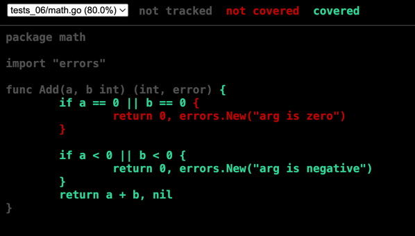
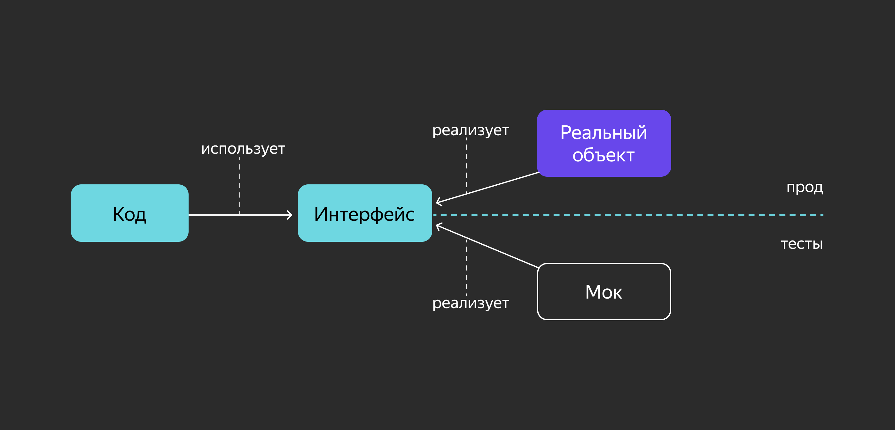
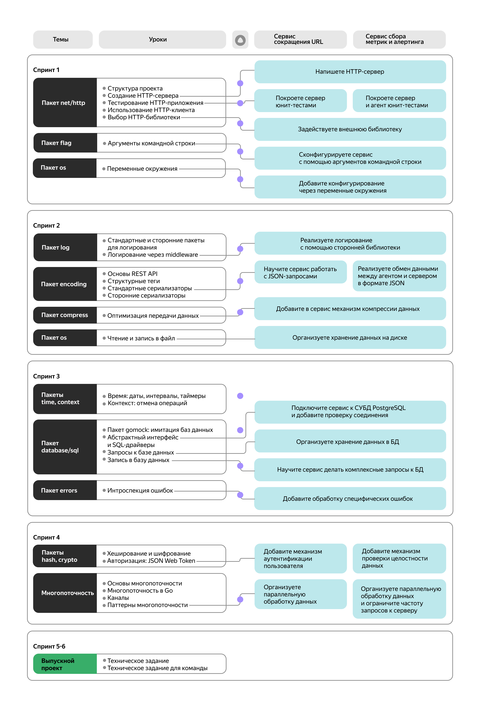
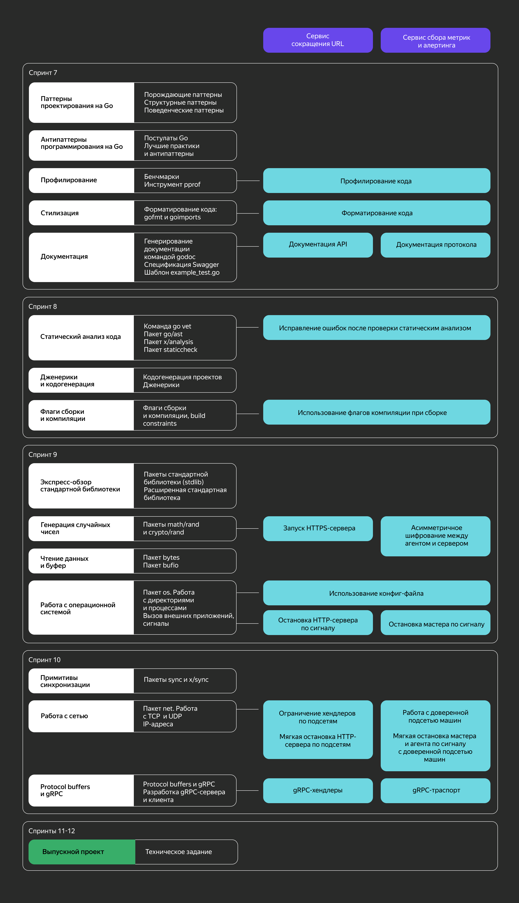

# GO

Пример простейшей программы:

````go
package main

import "fmt"  // импортируем пакет fmt стандартной библиотеки

func main() {
    fmt.Println("Hello, world!")
} 
````

Terminal run:

````bash
go run main.go
````

## Логические операторы и сравнения

`>` — больше;  
`<` — меньше;  
`>=` — больше или равно;  
`<=` — меньше или равно;  
`==` — равно;  
`!=` — не равно.  

А также логические операторы:  

`&&` — логическое И;  
`||` — логическое ИЛИ;  
`!` — логическое НЕ.

## Объявление переменной

### Нотация по умолчанию

````GO
var a, b int  # объявление переменных
a, b = 1, 2  # присваивание значения переменным 

var a string
a = "abc"
````

````GO
var height int
var length int
var weight float64
var name   string
var company = "Рога и копыта"

// эквивалентно

var (
    height, length int
    weight float64
    name   string
    company = "Рога и копыта"
)
````

### Короткая нотация

````GO
int64Var := int64(5)  # тип указан в лоб, исключая автоопределение
float32Var := float32(101.3)

// эквивалентно

var int64Var int64 = 5 
var floatVar float32 = 101.3 
````

### Ключевое слово `iota`

````GO
type Weekday int

const (
    Monday Weekday = iota + 1
    Tuesday
    Wednesday
    Thursday
    Friday
    Saturday
    Sunday
)

func NextDay(day Weekday) Weekday {
    return (day % 7) + 1
}

func main() {
    var today Weekday = Sunday
    tomorrow := NextDay(today)
    fmt.Println("today =", today, "tomorrow =", tomorrow)
}
````

Output:  
today = 7 tomorrow = 1

## Объявление пользовательских типов

Для пользовательских типов можно определять методы (как для классов в ООП, об этом будет позже в курсе).

````GO
// декларация пользовательского типа
type MyType string
// декларация метода для пользовательского типа
func (mt MyType) MethodForMyType() {
    //логика метода
}
````

Чтобы привести один тип к другому:

````GO
type Name string
type Fruit string

var fruit Fruit
var name Name

fruit = "Apple"
name = Name(fruit) // так, после приведения типов, работает
````

## Операторы ветвления

### Условие `if — else`

````go
if a == 1 {
    // сценарий, если условие if выполнено
} else if a == 2 {
    // сценарий, если условие else if выполнено
} else {
    // сценарий, если условие else if не выполнено
}
````

### Условие `switch — case`

````go
var a int

switch a {
case 1:
    fmt.Println("1")
case 2:
    fmt.Println("2")
case 3, 4:
    fmt.Println("3 or 4")
default:
    fmt.Println("Default case")
}
````

Наличие блока `default` необязательно — его можно опустить, если не требуется описывать «стандартное» поведение. Этот блок выполнится, если ни одно из условий не отработало.

- 4example:  
Основное условие `switch` может быть не задано явно.

    ````go
    var a int

    switch {
    case a == 100:
        fmt.Println("EQ 100")
    case a > 0:
        fmt.Println("GT 0 AND NEQ 100")
    case a < 0:
        fmt.Println("LT 0 AND NEQ 100")
    }
    ````

- 4example:  
Внутри `switch` можно объявить локальную переменную

    ````go
    a := 6
    switch b := a % 5; {
    case b == 0:
        fmt.Println("Кратно 5")
    default:
        fmt.Printf("Остаток от деления на 5: %d", b)
    }
    ````

- 4example:  
Когда нужно всё-таки выполнить следующий блок, используют ключевое слово `fallthrough`.
Если указать его в конце блока кода, то после него будет выполнен блок в следующем `case` или `default`.

    ````go
    a := -100
    switch {
    case a > 0:
        if a % 2 == 0 {
            break
        }
        fmt.Println("Odd positive value received")
    case a < 0:
        fmt.Println("Negative value received")
        fallthrough
    default:
        fmt.Println("Default value handling")
    }
    ````

У ключевого слова `fallthrough` есть особенности:

- его можно использовать только в последней строке `case`, иначе будет ошибка компиляции;
- оно игнорирует условие следующего по порядку `case`.

## Виды циклов

### Бесконечный цикл

````go
for {
    // код, выполняемый внутри бесконечного цикла
}
````

### Трёхкомпонентный цикл

````go
// создаём переменную
v := 0
// 
for i := 1; i < 10; i++ {
    // наращиваем переменную
    v++
}
// выводим результат на экран
fmt.Println(v)
````

Классическая форма цикла состоит из трёх компонентов:  
`i := 1` — инициализация (pre-действие): выполняется единожды при входе в scope цикла;  
`i < 10` — основное условие: пока условие `true`, итерации будут продолжаться;  
`i++` — post-действие: выполняется по завершении каждой итерации цикла.  

Заполнять каждую компоненту необязательно — можно опускать.

#### Пример с сортировкой в обратном порядке

````go
arr := []int{1, 2, 3, 4, 5}

for i, j := 0, len(arr)-1; i < j; i, j = i+1, j-1 {
    arr[i], arr[j] = arr[j], arr[i]
}
````

Формат цикла `for`:

````go
for i, j := start, end; condition; post-statement {
// Тело цикла
}
````

- i, j := start, end — это начальная инициализация переменных.
- condition — условие, которое проверяется на каждой итерации цикла.
- post-statement — выражения, которые выполняются после каждой итерации (например, увеличение/уменьшение индексов).  

Разбор логики обратной сортировки:

1) Инициализация:

    - `i, j := 0, len(arr)-1`:
    - `i` инициализируется с `0` — это индекс первого элемента слайса.
    - `j` инициализируется с `len(arr)-1` — это индекс последнего элемента слайса.
    - Таким образом, `i` указывает на первый элемент слайса, а `j` — на последний.

2) Условие продолжения:

    - `i < j` — цикл будет выполняться, пока индекс `i` меньше индекса `j`.
    - Это важно, потому что мы начинаем с первого и последнего элемента и постепенно двигаемся к центру. Как только `i` становится больше или равным `j`, мы остановим цикл. Таким образом, элементы на “противоположных” концах слайса будут меняться местами, а когда они пересекутся, процесс завершится.

3) Шаги итерации:

    - `i, j = i+1, j-1` — на каждом шаге:
    - Увеличиваем `i` на `1`, т.е. двигаемся вправо.
    - Уменьшаем `j` на `1`, т.е. двигаемся влево.
    - Это позволяет сдвигать индексы навигации к центру слайса, чтобы обменять элементы, начиная с внешних и заканчивая центральными.

4) Меняем местами элементы:

    - `arr[i]`, `arr[j] = arr[j]`, `arr[i]`:
    - Меняются местами элементы с индексами `i` и `j`.
    - Таким образом, элементы с противоположных концов слайса обмениваются местами.

### Цикл с одним условием (аналог `while` из Python)

#### Цикл `for`

В цикле `for` можно указывать только одно условие. В этом случае необходимая начальная инициализация должна происходить перед циклом, а действия, влияющие на условие, — выполняться внутри цикла.

````go
for [инициализация счетчика]; [условие]; [изменение счетчика]{
    // действия
}
````

````go
package main

import "fmt"

func main() {
    // начальная инициализация
    i := 0
    for i < 5 {
        // выводим результат на экран
        fmt.Println(i)
        // наращиваем переменную
        i++
    }
}
````

##### Цикл `range`  

Используется для комплексных типов — слайса и мапы (map).  
(при работе с `map` будет выводить ключ и значение)

````go
fruits := []string{"apple", "banana", "cherry", "date"}

for index, fruit := range fruits {
    fmt.Printf("Index: %d, Fruit: %s\n", index, fruit)
}
// Index: 0, Fruit: apple
// Index: 1, Fruit: banana
// Index: 2, Fruit: cherry
// Index: 3, Fruit: date
````

`range fruits` — это конструкция, которая автоматически возвращает два значения для каждого элемента слайса:

- `index` — индекс текущего элемента в слайсе (целое число).
- `fruit` — значение элемента слайса на текущем индексе (строка).  

Eсли  не нужно использовать индекс, можно пропустить его, используя `_` -> `for _, fruit := range fruits { *** }`

#### Ключевые слова `break` и `continue`

````go
sum, limit := 0, 100
for i := 0; true; i++ {
    if i % 2 != 0 {
    continue // переход к следующему числу, так как i — нечётное
    }
    
    if sum + i > limit {
        break // выход из цикла, так как сумма превысит заданный предел
    }
    
    sum += i
}
fmt.Println(sum)
````

## Композитные типы

### Указатель - `&`, Ссылка на память - `&`  

Указатель — это значение, указывающее на адрес памяти другой переменной.  
У каждой переменной есть адрес, мы можем передавать его, а не сами данные, хранящиеся в ячейке памяти. За хранение значения адреса переменной в Go отвечают указатели.

````go
var p *int // создали переменную типа «указатель на целое число»
````

Чтобы присвоить указателю значение (адрес какой-либо переменной), используется операция взятия адреса `&`:

````go
var a int = 5
p := &a

fmt.Println(a,p) //a=5 p=0xc0000b2008
````

ВАЖНО! У `const` забрать адрес не получится

Тип указателя на указатель описывается как `**T`, например `**int`.
Чтобы получить или изменить значение, хранящееся по указателю, применяют оператор разыменования (dereference) `*`.

````go
i := 42
p := &i
fmt.Println(*p) // читаем значение переменной i через указатель p
*p = 21         // записываем в переменную i значение 21 через указатель p
````

#### Пример работы с Указателями в структурах данных

Есть структура описывающаю польлзователя:

````go
type Person struct {
  Name string
  Age int
  lastVisited time.Time
}  
````

В поле `lastVisited` нужно сохранять дату последнего посещения.

Без указателей функция выглядела бы примерно так:

````go
func GetPersonWithLastVisited(p Person) Person {
  p.lastVisited = time.Now() // time.Now() возвращает текущее время
    return p
}

// использование в другом пакете
p := Person{
  Name: "Alex",
  Age: 25,
}
p = GetPersonWithLastVisited(p)
````

C указателями всё становится проще:

````go
func UpdatePersonWithLastVisited (p *Person )  {
  p.lastVisited = time.Now() 
} 

// использование в другом пакете
p := Person{
  Name: "Alex",
  Age: 25,
}
UpdatePersonWithLastVisited(&p)
````

Здесь в функцию был передан указатель на переменную, что позволило изменить её поле без дополнительного копирования. С другой стороны, если функция не изменяет передаваемые ей параметры, то лучше не использовать указатели, а передавать переменные по значению.

### Массивы

Основная проблема при присваивании `:=` массивов - массив полностью копируется.

#### Одномерный массив

Массив — это последовательность фиксированной длины, состоящая из элементов одного типа.  

Пример объявления/инициализации массива:

````go
var lastWeekTemp [7]int // [0 0 0 0 0 0 0]

someText := [4]string{"blue coral", "staghorn coral", "pillar coral", "elkhorn coral"} // [blue coral staghorn coral pillar coral elkhorn coral]

thisWeekTemp := [7]int {-3,5,7} // [-3 5 7 0 0 0 0]

rgbColor := [3]uint8 {255, 255, 128} // [255 255 128]

rgbColor := [...]uint8{255, 255, 128} // [255 255 128] len = 3
````

В списке инициализации можно указать только нужные элементы и их индексы. Индекс и значение указываются через двоеточие.

````go
thisWeekTemp := [7]int {6:11, 2:3} // [0 0 3 0 0 0 11]
````

#### Многомерный массив

Каждая размерность массива указывается в отдельных квадратных скобках.

````go
var thisMonthTemp [4][7]int // массив из четырёх недель, каждая из которых — массив из семи дней 

var rgbImage [1080][1920][3]uint8 // изображение — это массив из 1080 строк длиной в 1920 пикселей. Каждый пиксель — массив из трёх байт
            // 1080 — размер массива
            // [1920][3]uint8 — тип элемента
````

Доступ к элементам многомерного массива осуществляется через квадратные скобки:

````go
line := rgbImage [2] // 3-я строка в изображении
pixel := rgbImage[2][3] // 4-й пиксель в третьей строке изображения
red :=  rgbImage[2][3][1] // значение синей компоненты (второй байт) 4-го пикселя в третьей строке изображения
````

##### Обход значений массива

Оператор `range` на каждой итерации возвращает индекс и значение следующего элемента в массиве.

Конструкция `for range`, которая позволяет обойти элементы массива последовательно, не используя дополнительные переменные:

````go
var weekTemp = [7]int{5, 4, 6, 8, 11, 9, 5} 

sumTemp := 0

for _, temp := range weekTemp {
    sumTemp += temp
}

average := sumTemp / len(weekTemp)
````

ВАЖНО! Для изменения порядка подхода необходимо применять цикл `for`

#### Слайс (Slice)

Слайс (Slice)

Слайс — это динамический массив, который может изменять свой размер во время выполнения программы. Он представляет собой более гибкую структуру данных по сравнению с обычными массивами, так как не имеет фиксированного размера.

Слайс имеет структуру:

- указатель на первый элемент базового массива — `ptr`;
- длина слайса — `len`, количество элементов в слайсе;
- ёмкость слайса — `cap`, количество элементов в массиве (это количество элементов, которые могут быть размещены в слайсе, не требуя выделения новой памяти).

##### Создание слайса

- Слайс можно инициализировать несколькими способами:

````go
// 1. Создание слайса через литерал
var s1 = []int{1, 2, 3, 4} // не указывается размер массива

// 2. Создание пустого слайса заданной длины
var s2 = make([]int, 5) // слайс длиной 5, все элементы инициализированы нулями

// 3. Создание слайса с заданной длиной и емкостью
var s3 = make([]int, 5, 10) // длина 5, емкость 10
````

- Получение слайса из массива: В Go можно получить слайс из массива или другого слайса, используя синтаксис с индексами:

````go
arr := [5]int{1, 2, 3, 4, 5}
s := arr[1:4]  // Слайс с элементами 2, 3, 4
o := arr[:]    // Слайс с элементами 1, 2, 3, 4, 5
````

- Многомерный слайс:

````go
seaNames := [][]string{{"shark", "octopus", "squid", "mantis shrimp"}, {"Sammy", "Jesse", "Drew", "Jamie"}}

fmt.Println(seaNames[1][0]) // Sammy
````

##### Добавление элементов в слайс

Можно использовать встроенную функцию `append()`, чтобы добавить элементы в слайс.

````go
s := []int{1, 2}
s = append(s, 3, 4)
fmt.Println(s)  // [1, 2, 3, 4]
````

##### Создание нового слайса из существующего слайса  

`[i:j]`, где `i` — индекс первого элемента нового слайса, а `j` — индекс следующего элемента, НЕ входящего в новый слайс.  
ВАЖНО! ссылка все еще ведет на основной слайс `weekTempArr`  

````go
weekTempArr := [7]int{1, 2, 3, 4, 5, 6, 7}
workDaysSlice := weekTempArr[:5]
weekendSlice := weekTempArr[5:]
weekTempSlice := weekTempArr[:]

fmt.Println(workDaysSlice, len(workDaysSlice), cap(workDaysSlice)) // [1 2 3 4 5] 5 7
fmt.Println(weekendSlice, len(weekendSlice), cap(weekendSlice)) // [6 7] 2 2 
fmt.Println(weekTempSlice, len(weekTempSlice), cap(weekTempSlice)) // [1 2 3 4 5 6 7] 7 7
````

##### Объединение двух слайсов

используется синтаксис расширения `...`

````go
someNum := []int{1}
newSomeNum := []int{100, 200}
newSomeNum = append(newSomeNum, someNum...)

fmt.Println(newSomeNum, len(newSomeNum), cap(newSomeNum)) // [100 200 1 2] [100 200 1] 3 4
````

````go
s = append(s[0:2], s[4:]...) 
````

##### Копирование слайса

- Использование `copy()`:  
Функция `copy(destination, source)` копирует элементы из слайса `source` в слайс `destination`.

````go
a := []int{1, 2, 3, 4}

b := make([]int, len(a)) // Создаём новый слайс той же длины, что и a
с := make([]int, 2)      // Создаём новый слайс с длиной 2
copy(b, a)               // Копируем элементы из a в b
copy(c, a)               // Копируем элементы из a в c
fmt.Println(a) // [1 2 3 4]
fmt.Println(b) // [1 2 3 4]
fmt.Println(c) // [1 2]
````

- Использование `append()` для создания копии:

````go
a := []int{1, 2, 3, 4}
b := append([]int(nil), a...) // Копируем слайс a в новый слайс b

fmt.Println(a) // [1 2 3 4]
fmt.Println(b) // [1 2 3 4]
````

##### Удаление последнего элемента слайса

````go
s := []int{1, 2, 3}
if len(s) != 0 { // защищаемся от паники
    s = s[:len(s)-1]
}
fmt.Println(s) // [1 2]
````

##### Удаление первого элемента слайса

````go
s := []int{1,2,3}
if len(s) != 0 { // защищаемся от паники
    s = s[1:]
} 
fmt.Println(s) // [2 3]
````

##### Удаление элемента слайса с индексом `i`

````go
s := []int{1,2,3,4,5}
i := 2

if len(s) != 0 && i < len(s) { // защищаемся от паники
    s = append(s[:i], s[i+1:]...)
} 
fmt.Println(s) // [1 2 4 5]
````

##### Сравнение двух слайсов

````go
s1 := []int{1,2,3}
s2 := []int{1,2,4}
s3 := []string{"1","2","3"}
s4 := []int{1,2,3}

fmt.Println(reflect.DeepEqual(s1,s2)) // false
fmt.Println(reflect.DeepEqual(s1,s3)) // false
fmt.Println(reflect.DeepEqual(s1,s4)) // true
````

##### Альтернатива `range` добавления элементов в слайс

````go
var newSlice = []int{}

for i := 1; i < 101; i++ {
  newSlice = append(newSlice, i)
 } // наполнит слайс newSlice от 1 до 100
````

##### Сортировка в обратном порядке `for / range`

###### Вариант 1

````go
arr := []int{1, 2, 3, 4, 5}

for i, j := 0, len(arr)-1; i < j; i, j = i+1, j-1 {
    arr[i], arr[j] = arr[j], arr[i]
}
````

Разбор логики обратной сортировки:

1) Инициализация:

    - `i, j := 0, len(arr)-1`:
    - `i` инициализируется с `0` — это индекс первого элемента слайса.
    - `j` инициализируется с `len(arr)-1` — это индекс последнего элемента слайса.
    - Таким образом, `i` указывает на первый элемент слайса, а `j` — на последний.

2) Условие продолжения:

    - `i < j` — цикл будет выполняться, пока индекс `i` меньше индекса `j`.
    - Это важно, потому что мы начинаем с первого и последнего элемента и постепенно двигаемся к центру. Как только `i` становится больше или равным `j`, мы остановим цикл. Таким образом, элементы на “противоположных” концах слайса будут меняться местами, а когда они пересекутся, процесс завершится.

3) Шаги итерации:

    - `i, j = i+1, j-1` — на каждом шаге:
    - Увеличиваем `i` на `1`, т.е. двигаемся вправо.
    - Уменьшаем `j` на `1`, т.е. двигаемся влево.
    - Это позволяет сдвигать индексы навигации к центру слайса, чтобы обменять элементы, начиная с внешних и заканчивая центральными.

4) Меняем местами элементы:

    - `arr[i]`, `arr[j] = arr[j]`,`arr[i]`:
    - Меняются местами элементы с индексами `i` и `j`.
    - Таким образом, элементы с противоположных концов слайса обмениваются местами.

###### Вариант 2

````go
arr := []int{1, 2, 3, 4, 5}
dim = len(arr)

for i := range arr[:dim/2] {
    arr[i], arr[dim-i-1] = arr[dim-i-1], arr[i]
}
````

1) Начало цикла for: `for i := range arr[:dim/2] {`  
    - `arr[:dim/2]` — это срез слайса, который включает только первую половину элементов. Для слайса с 5 элементами это будет срез, включающий первые 2 элемента:
    - `arr[:dim/2]` эквивалентно `arr[:2]`, то есть срез `[]int{1, 2}`.
    - `dim/2` равно `5/2 = 2`, то есть срез будет включать индексы от `0` до `1`.
    - `for i := range arr[:dim/2]` — этот цикл будет перебирать индексы первых двух элементов слайса (то есть `i` будет принимать значения `0` и `1`):
    - На первой итерации `i = 0`.
    - На второй итерации `i = 1`.

2) Обмен элементов `arr[i], arr[dim-i-1] = arr[dim-i-1], arr[i]`  
    - `arr[i]` — это элемент с индексом i из первой половины слайса.
    - `arr[dim-i-1]` — это элемент с индексом, который находится на симметричной позиции в правой половине слайса. Например:
    - Если `i = 0`, то `arr[dim-i-1]` будет равно `arr[5-0-1] = arr[4]`.
    - Если `i = 1`, то `arr[dim-i-1]` будет равно `arr[5-1-1] = arr[3]`.
    Таким образом, элементы на позициях `i` и `dim-i-1` меняются местами.

Разбор по шагам:

На первой итерации `(i = 0)`:

- `arr[0]` (значение `1`) меняется местами с `arr[4]` (значение `5`).
- Результат: `arr = [5, 2, 3, 4, 1]`.

На второй итерации `(i = 1)`:

- `arr[1]` (значение `2`) меняется местами с `arr[3]` (значение `4`).
- Результат: `arr = [5, 4, 3, 2, 1]`.

ВАЖНО! Разернуть строку таким образом не получится, так как строка — неизменяемый тип данных. Нужно создать слайс рун из строки и развернуть его.

##### Cheat-sheet (SLICE)

[Go Slice Tricks Cheat Sheet](https://ueokande.github.io/go-slice-tricks/)

#### Мапа (Map) - ассоциативный Массив

Мапа (или словарь, хеш-таблица) — это структура данных, которая хранит пары “ключ-значение” `Map[key] = value`. Каждый ключ в мапе уникален, и с помощью ключа можно быстро получить соответствующее значение.

Создание мапы:

- Инициализация мапы: Мапы можно создать с помощью функции `make()` или с помощью литерала.
- `map` — ссылочный тип (reference type), поэтому помимо объявления мапы необходима явная инициализация `:=`

Две переменные ссылочного типа могут указывать на один и тот же объект. Для простых типов это выглядит так:

````go
x := 5
y := x
x++
// x станет равен 6
// y останется равен 5
````

А для ссылочных типов — так:

````go
MyMap2 := MyMap1
MyMap1["foo"] = "bar"
// в MyMap2 тоже появится пара с ключом foo и значением bar
// если поменяем значение в MyMap2,
MyMap2["foo"] = "bazz"
// то изменится значение и в MyMap1
````

Пример с объявлением нового типа мапы:

````go
type MyMap map[string] string // новый тип MyMap, с key типа string и value типа string

var m1 MyMap            // объявление переменной m1 типа MyMap
m1 = make(MyMap, 5)     // инициализация с помощъю make() с cap=5 (не обязательно указывать емкость)

// объект готов
m1["foo"] = "bar" // заполнение мапы 
````

Примеры с инициализаций без объявления нового типа:

````go
// 1. Создание пустой мапы с заданным типом ключа и значения
var m1 = make(map[string]int)

m1["Alice"] = 25  // заполнение мапы 
m1["Bob"]= 30     // заполнение мапы 

// 2. Инициализация мапы с элементами
m2 := map[string]int{"Alice": 25, "Bob": 30}

// 3. Создание пустой мапы
var m3 = map[string]int{}
````

`nil` — единственное значение, с которым можно сравнивать `map`. Сравнивать `map` друг с другом нельзя!

Проверка, что `map` инициализирована:

````go
var m map[string]string  // мапа объявлена, но не инициализирована  
if m != nil {            // если не проверить это условие,
    m["foo"] = "bar"     // то здесь можно получить panic
}
````

Добавление и изменение элементов:  
Для добавления или изменения значений в мапе используется синтаксис с квадратными скобками:

````go
m := make(map[string]int)
m["age"] = 25  // Добавление элемента
m["age"] = 30  // Изменение значения
````

Удаление элементов:  
Для удаления элемента из мапы используется встроенная функция delete():

````go
delete(m, "age")  // Удаление элемента с ключом "age"
````

Проверка существования ключа:  
Чтобы проверить, существует ли ключ в мапе, можно использовать второй возвращаемый параметр:

````go
value, exists := m["age"]
if exists {
    fmt.Println("Значение:", value)
} else {
    fmt.Println("Ключ не найден")
}
````

Использование в циклах `range`

````go
m := make(map[string]string)
m["foo"] = "bar"
m["bazz"] = "yup"
for k, v := range m {
    // k будет перебирать ключи,
    // v — соответствующие этим ключам значения
    fmt.Printf("Ключ %v, имеет значение %v \n", k, v)
}
````

### Структуры

Структуры представляют тип данных, определяемый разработчиком и служащий для представления каких-либо объектов. Для определения структуры применяются ключевые слова `type` и `struct`:

````go
type Person struct {
    Name        string
    Email       string
    dateOfBirth time.Time
} 
````

Классический пример — структура данных «дерево» c  указателями на саму структуру:

````go
type Tree struct {
    Value      int
    LeftChild  *Tree
    RightChild *Tree
}
````

#### Подходы к созданию экземпляров объектов

##### Пример инициализации `struct`

````go
type Person struct {
    Name string // Имя
    Age  int    // Возраст
}

man := Person{
    Name: "Alex", 
    Age: 30
}
// инициализация с явно прописанным названием полей 

fmt.Printf("Man %#v", man)
````

##### Доступ к полям структуры

````go
p := NewPerson("Иван", "ivan@yandex.ru", 2000, 12, 1)
fmt.Println(p.Name, p.Email)

p.Name = "Пётр"
fmt.Println(p.Name)

// Иван ivan@yandex.ru
// Пётр 
````

#### Подход - Пустой объект

Все поля структуры при таком подходе принимают значения по умолчанию.

````go
p := Person{}
// или
var p Person
````

Подход применяют:

- когда экземпляр не требует специальной инициализации и может быть использован дальше по коду;
- когда для инициализации полей нужны дополнительные условия и данные, то есть выставление значений конкретных полей будет следовать ниже по коду.

#### Подход - Неявное указание значений полей

При таком подходе перечисляют значения для всех полей структуры, используя литералы либо значения внешних переменных.

````go
date := time.Date(2000, 12, 1, 0, 0, 0, 0, time.UTC)
p := Person{"Иван", "ivan@yandex.ru", date}
````

Требования:

- Нужно перечислить все поля объекта.
- Порядок следования аргументов инициализатора должен совпадать с порядком описания полей структуры. Если поставить поле `Email` на первое место в описании `type Person struct`, инициализация экземпляра выше будет некорректна (с точки зрения логики, но не компилятора).  

Подход применяют:

- когда нужно явно указать значения всех полей объекта;
- когда вы уверены, что спецификация типа не будет меняться часто, иначе придётся вносить правки для каждого инициализатора объекта в коде.

#### Подход - Явное указание значений полей

````go
p := Person{
    Name: "Иван", 
    Email: "ivan@yandex.ru"
}
````

Особенности:

- этот подход отличается от первого опциональным указанием полей;
- порядок указания полей не важен;
- значения полей, которые не были использованы в инициализаторе (`dateOfBirth` в примере), примут значения по умолчанию.  

Подход применяют:

- почти всегда, так как он лишён ограничений, описанных выше.

#### Подход - Конструктор

В Go нет синтаксиса конструкторов и деструкторов, но часто можно встретить аналог:

````go
func NewPerson(name, email string, dobYear, dobMonth, dobDay int) (Person, error) {
    return Person{
        Name:        name,
        Email:       email,
        dateOfBirth: time.Date(dobYear, time.Month(dobMonth), dobDay, 0, 0, 0, 0, time.UTC),
    }
}
````

Некоторые правила, одобренные Go-сообществом:

- имя функции конструктора пишут с префиксом `New`;
- если конструктор производит валидацию аргументов, функция должна возвращать ошибку последним аргументом.

Подход применяют:

- когда нужно производить валидацию аргументов, чтобы построить логически правильный объект;
- когда построение экземпляра объекта требует дополнительных действий, например, подключения к базе данных.

### Области видимости

В Go есть понятия экспортируемых и неэкспортируемых типов. Код разделяется на пакеты, и, чтобы тип, функция или глобальная переменная были доступны в другом пакете, их имена должны начинаться с заглавной буквы. Это же правило работает для полей и методов структуры.

В примере выше `Person` — экспортируемый тип (публичный). Другие пакеты могут создавать экземпляры этого типа и иметь доступ к публичным полям `Name` и `Email`. А поле `dateOfBirth` — неэкспортируемое (приватное).

Пример экспортирования приватного типа:

````go
package foo

// privateFoo — неэкспортируемый тип
type privateFoo struct {
    Value string
}

// NewPrivateFoo — конструктор типа privateFoo
// Функция публичная, то есть может быть вызвана из других пакетов
func NewPrivateFoo() privateFoo {
    return privateFoo{Value: "some data"}
}
````

````go
package main

import "github.com/the_greatest_coder/hello_go/foo"

func main() {
    // f := foo.privateFoo{} // ошибка компиляции
    f := foo.NewPrivateFoo()
    fmt.Println(f.Value) // поле Value экспортируемое, то есть его можно использовать
}
````

````go
some data
````

#### Теги

У каждого поля структуры может быть набор аннотаций, которые называются тегами `tags`:

````go
type GetUserRequest struct {
    UserId string `json:"user_id" yaml: "user_id" format:"uuid" example:"2e263a90-b74b-11eb-8529-0242ac130003"`
    IsDeleted *bool `json:"is_deleted,omitempty" yaml:"is_deleted"`
}
````

Теги не влияют на представление или работу с данными напрямую, но могут использоваться пакетами для получения дополнительной информации о конкретном поле.

Набор тегов с их значениями можно представить как набор ключей и значений, где ключи разделяются пробелами, а значения ключей — запятой.

В примере выше встречаются следующие теги:

- `json` — используется пакетом `encoding/json` для сериализации/десерилизации структур в `JSON`;
- `yaml` — похож на `json`, но используется внешними библиотеками для работы с форматом `YAML`;
- `format` и `example` — могут быть как подсказкой для разработчика, так и аннотацией для генерации Swagger-описания (к примеру, библиотекой `swag`).

Применяемые аннотации чаще всего зависят от используемой библиотеки. Возможные ключи и значения стоит искать в документации пакета (в худшем случае — в коде).  

Разработчик может вводить свои теги и работать с ними через пакет `reflect` стандартной библиотеки.

Пример сериализации в `json`:

````go
type Person struct {
    Name        string    `json:"full_name"`
    Email       string    `json:"email"`
    DateOfBirth time.Time `json:"-"` // - означает, что это поле не будет сериализовано
}

func main() {
    man := Person{
        Name:        "Alex",
        Email:       "alex@yandex.ru",
        DateOfBirth: time.Now(),
    }
    jsMan, err := json.Marshal(man) // Сериализация структуры в JSON
    if err != nil {                 // обработка ошибки при сериализации
        log.Fatalln("unable marshal to json")
    }
    fmt.Printf("Man %v", string(jsMan)) // Man {"full_name":"Alex","email":"alex@yandex.ru"}
}

// {
//   "full_name": "Aлекс",
//   "email": "alex@yandex.ru"
// }
````

#### Анонимные структуры

Cтруктура, которая не имеет имени. Она используется для создания одноразовых объектов, когда нет необходимости в отдельном типе данных.

Анонимные структуры могут быть использованы в качестве поля внутри другой структуры.

````go
package main

import "fmt"

func main() {
    person := struct {
        Name    string
        Age     int
        Address string
        Contact struct {
            Phone string
            Email string
        }
    }{
        Name:    "Alex",
        Age:     30,
        Address: "Moscow",
        Contact: struct {
            Phone string
            Email string
        }{
            Phone: "123-456-789",
            Email: "alex@example.com",
        },
    }

    fmt.Println(person) // {Alex 30 Moscow {123-456-789 alex@example.com}}
}
````

- В этом примере структура `Contact` также является анонимной и используется как поле внутри структуры person.
- При этом `person` тоже является анонимной структурой.

Пример использования анонимной структуры при построении REST-запроса:

````go
req := struct {
    NameContains string `json:"name_contains"`
    Offset       int    `json:"offset"`
    Limit        int    `json:"limit"`
}{
    NameContains: "Иван",
    Limit:        50,
}

reqRaw, _ := json.Marshal(req)
fmt.Println(string(reqRaw))

// {"name_contains":"Иван","offset":0,"limit":50} 
````

#### `struct{}`

````go
var c struct{}
// или
c := struct{}{}

fmt.Println(unsafe.Sizeof(c))
fmt.Println(unsafe.Pointer(&c))

// 0
// 0x11d46e8 
````

Размер `struct{}` равен `0`, при этом объект c имеет адрес. Такую лазейку можно использовать для оптимизации кода по памяти

## Функции

Объявление функции:

````go
func name_func (params) (types_return){
    body_func
}
````

### Variadic functions

variadic functions - функции с переменным количеством переменных. Внутри функции этот параметр рассматривается как нумерованная последовательность аргументов `slice`

````go
func Sum(x ...int) (res int) {
    for _, v := range x {
        res += v
    }
    return
}

sum := Sum(2, 3, 5, 1, 2, 57)
````

### Рекурсивные функции

Рекурсивная функция вызывает сама себя.

````go
// хрестоматийный пример рекурсивного вычисления n!, факториала числа:

func fact(n int) int {
    if n == 0 {    // терминальная ветка — то есть условие выхода из рекурсии
        return 1
    } else {    // рекурсивная ветка 
        return n * fact(n-1)
    }
}
````

````go
// числа Фибоначчи

func Fib(n int) int {
    switch {
    case n <= 1:    // терминальная ветка 
        return n
    default:        // рекурсивная ветка
        return Fib(n-1) + Fib(n-2)
    }
}
````

### Функция первого класса и `lambda`

Функцию можно присвоить переменной, можно передать аргументом другой функции. Функция может возвращать в качестве значения другую функцию.  

Тип функции виден в её сигнатуре, то есть определяется как набор типов и количества аргументов, возвращаемых значений.

````go
func Say(animal string) (v string) {
    switch animal {
    default:
        v = "heh"
    case "dog":
        v = "gav"
    case "cat":
        v = "myau"
    case "cow":
        v = "mu"
    }
    return
}

// func Say имеет тип:
// func(string) string
````

Можно присвоить её переменной такого типа:

````go
var voice func(string) string
voice = Say
````

Можно написать функцию высшего порядка с параметром такого типа:

````go
func Print(who string, how func(string) string){
    fmt.Println(how(who))
}

// вызов функции с аргументом
Print("dog", Say)
````

#### Литеральная форма синтаксиса функции

Для функции есть литеральная форма синтаксиса. Функцию можно создать по месту, не декларируя и не именуя в блоке деклараций.

````go
f := func(s string) string { return s }
// Это то, что ещё называют анонимной или лямбда-функцией.
````

Можно написать функцию, которая возвращает функции значениями:

````go
func Do(say bool) func(string) string {
    if say {
        return Say
    }
    return func(s string) string { return s }
}

// вызов функции с аргументом
Print("dog", Do(true))
````

#### Замыкания (генераторы)

Лексическая область видимости (lexically scoped) - это значит, что переменные, определённые в окружающих блоках видимости (например, глобальные переменные), доступны функции всегда, а не только на время вызова. Можно считать, что функция их запоминает.

Лексическая область видимости и анонимные функции позволяют реализовать замыкания (closure).  

Такие функции иногда называют генераторами.

- Замыкание захватывает переменную в момент создания замыкания;
- Замыкание может изменять значение внешней переменной.

Когда полезны замыкания?

- Глобальные переменные: Когда вам нужно, чтобы несколько функций в программе использовали общие данные.
- Локальные переменные: Когда вам нужно инкапсулировать состояние внутри конкретной функции и позволить анонимной функции работать с этим состоянием.

##### Пример с разбором логики замыкания

````go
package main

import "fmt"

// Функция, которая возвращает самоссылочную функцию
func makeMultiplier(factor int) func(int) int {
    return func(x int) int {
        return x * factor
    }
}

func main() {
    multiplyBy2 := makeMultiplier(2)  //  переменная multiplyBy2 будет хранить функцию, которая умножает числа на 2
    multiplyBy3 := makeMultiplier(3)  // переменная multiplyBy2 будет хранить функцию, которая умножает числа на 3
    // Обе функции, возвращенные из makeMultiplier, ссылаются на свои собственные значения factor — 2 для multiplyBy2 и 3 для multiplyBy3. 
    // В этом и заключается принцип замыкания.

    fmt.Println(multiplyBy2(5)) // 10 
    fmt.Println(multiplyBy3(5)) // 15
}
````

Что происходит:

 1. `makeMultiplier(factor int)` — это функция, которая принимает один параметр `factor` (например, `2` или `3`) и возвращает другую функцию. Эта возвращаемая функция принимает параметр `x` и возвращает его умноженным на `factor`.

 2. Закрытие или замыкание (`closure`):

- Функция, которая возвращается из `makeMultiplier`, ссылается на переменную `factor`, даже если она была определена в родительской функции (`makeMultiplier`).
- Когда мы вызываем `makeMultiplier(2)`, она возвращает функцию, которая умножает число `x` на `2`.
- Когда мы вызываем `makeMultiplier(3)`, она возвращает функцию, которая умножает число `x` на `3`.

“замкнута” на factor:

Функция замкнута на переменной `factor`, это означает, что возвращаемая функция запоминает значение `factor`, которое было передано при её создании, и использует это значение даже после того, как функция `makeMultiplier` уже завершила своё выполнение.

Это называется замыканием (`closure`), и его ключевая особенность заключается в том, что возвращаемая функция “запоминает” внешние переменные, к которым она имеет доступ. Эти переменные продолжают существовать в памяти и доступны даже после того, как внешний контекст (в котором они были определены) завершил выполнение.

Когда мы вызываем:

````go
multiplyBy2 := makeMultiplier(2)
multiplyBy3 := makeMultiplier(3)
````

- Переменная `multiplyBy2` будет хранить функцию, которая умножает числа на `2`.
- Переменная `multiplyBy3` будет хранить функцию, которая умножает числа на `3`.

Обе функции, возвращенные из makeMultiplier, ссылаются на свои собственные значения `factor` — `2` для `multiplyBy2` и `3` для `multiplyBy3`. В этом и заключается принцип замыкания.

Почему это важно:

 1. Гибкость: Каждое замыкание (возвращенная функция) может “помнить” свое окружение, т.е. значение переменной `factor`, с которой оно было создано.
 2. Конфиденциальность: Мы можем скрыть детали реализации внутри функции `makeMultiplier` и предоставить пользователю только нужный интерфейс — возвращаемую функцию, которая работает с заданным параметром.

##### Простой пример замыкания

````go
package main

import "fmt"

func main() {
    // Переменная, которая будет запомнена функцией
    counter := 0

    // Замыкание: анонимная функция, использующая переменную counter
    increment := func() int {
        counter++
        return counter
    }

    // Вызов функции, она продолжает использовать переменную counter
    fmt.Println(increment()) // 1
    fmt.Println(increment()) // 2
    fmt.Println(increment()) // 3
}
````

Пояснение:

 1. Функция `increment`:
    - Это анонимная функция (функция без имени), которая увеличивает значение переменной `counter` на `1` при каждом её вызове и возвращает новое значение переменной.
    - Функция `increment` замкнута на переменной `counter`, т.е. она “помнит” состояние этой переменной, даже после того, как её основная область видимости завершится.

 2. Использование замыкания:
    - При каждом вызове `increment()`, переменная `counter` увеличивается на `1`, и результат возвращается на экран.
    - Даже если переменная `counter` была объявлена в функции `main` (т.е. в другой области видимости), анонимная функция продолжает ссылаться на неё и модифицировать её значение.
    - Это и есть поведение замыкания: функция может захватывать (или “запоминать”) переменные из своей внешней области видимости и продолжать с ними работать даже после того, как эта область завершена.

 3. Результат выполнения программы:
    - При каждом вызове функции `increment()` значение переменной `counter` увеличивается на `1`

Объяснение:

- Мы создали переменную `counter` и анонимную функцию `increment`, которая увеличивает её значение на `1`.
- Каждое вызовы `increment()` увеличивает `counter` и возвращает его новое значение.
- Важно, что `counter` остаётся доступным для функции `increment`, даже если основная функция `main` завершила выполнение.

###### Пример работы замыкания с глобальной переменный и обычной функцией

````go
package main

import "fmt"

// Глобальная переменная
var a int

// Функция, изменяющая глобальную переменную
func updateA() {
    a = 5
}

// Замыкание, которое изменяет глобальную переменную
func closure() int {
    a++  // Увеличивает глобальную переменную a
    return a
}

func main() {
    fmt.Println(closure())  // 1 (a = 0 + 1)
    updateA()               // a = 5
    fmt.Println(closure())  // 6 (a = 5 + 1)
    updateA()               // a = 5 (функция не изменяет глобальную переменную)
    fmt.Println(closure())  // 6 (a не изменился, замыкание продолжает использовать a = 5)
}
````

###### Пример: Генерация уникальных ID

Предположим, у нас есть сервер, который генерирует уникальные идентификаторы для пользователей. Мы можем использовать замыкания для создания счётчика уникальных ID, который будет увеличиваться при каждом запросе.

````go
package main

import (
    "fmt"
    "sync"
)

func main() {
    var mu sync.Mutex

    // Замыкание для генерации уникальных ID
    generateID := func() func() int {
        id := 0
        return func() int {
            mu.Lock()
            id++
            mu.Unlock()
            return id
        }
    }

    getNextID := generateID()

    // Генерация уникальных ID
    fmt.Println(getNextID()) // 1
    fmt.Println(getNextID()) // 2
    fmt.Println(getNextID()) // 3
}
````

Объяснение:

- `generateID` — это замыкание, которое создаёт функцию для генерации уникального `ID`. Эта функция будет увеличивать значение `id` каждый раз, когда она вызывается.
- Мы используем мьютекс `mu` для защиты от гонок (`concurrency`), чтобы несколько горутин не изменяли `id` одновременно.

###### Пример: Обработчик HTTP запросов

Представьте, что вам нужно создать обработчик для разных типов API-запросов, и для каждого типа запроса вам нужно запомнить некоторое состояние (например, количество вызовов). Замыкание может быть полезно для хранения этого состояния.

````go
package main

import (
    "fmt"
    "net/http"
    "sync"
)

func main() {
    var mu sync.Mutex

    // Замыкание для подсчёта количества вызовов
    requestCounter := func() func() int {
        count := 0
        return func() int {
            mu.Lock()
            count++
            mu.Unlock()
            return count
        }
    }

    counter := requestCounter()

    http.HandleFunc("/", func(w http.ResponseWriter, r *http.Request) {
        fmt.Fprintf(w, "Request number: %d", counter()) // Выводит номер запроса
    })

    fmt.Println("Server started at http://localhost:8080")
    http.ListenAndServe(":8080", nil) // Запуск сервера
}
````

Объяснение:

- В этом примере мы создаём замыкание `requestCounter`, которое запоминает количество запросов. Каждый раз, когда сервер обрабатывает новый запрос, функция `counter()` увеличивает счётчик и возвращает его текущее значение.
- Замыкание позволяет сохранить состояние счётчика между вызовами обработчика, даже если сама функция обработчика выполняется несколько раз.

##### “Self-referential functions and the design of options” -  Роб Пайк

Допустим, у нас есть функция, которая накапливает значение и может изменять это поведение через замыкание.

````go
package main

import "fmt"

func newCounter(start int) func(int) int {
    count := start
    return func(increment int) int {
        count += increment  // Здесь 'increment' является опцией, которая изменяет состояние
        return count
    }
}

func main() {
    counter := newCounter(10)  // Начальное значение 10

    fmt.Println(counter(5))  // 15 (прибавляем 5)
    fmt.Println(counter(3))  // 18 (прибавляем 3)
    fmt.Println(counter(10)) // 28 (прибавляем 10)
}
````

Когда вы вызываете `counter(5)`, параметр `5` можно рассматривать как опцию, которая влияет на состояние замыкания.

Логика работы замыкания из примера:

 1. Когда вы создаете замыкание с помощью `newCounter(10)`, функция `newCounter` возвращает анонимную функцию, которая увеличивает внутреннюю переменную `count`. Эта переменная сохраняет свое состояние между вызовами, потому что она находится внутри замыкания.
 2. Передача параметра в замыкание:
Когда вы вызываете `counter(5)`, вы передаете значение `5` в качестве параметра для этой анонимной функции. В этом контексте параметр `5` называется опцией, так как он передается функции для изменения поведения замыкания.

Например:

- В первый раз, когда вы вызываете `counter(5)`, внутренний счетчик увеличивается на `5`, и результат равен `15` (начальное значение было `10`).
- Во второй раз, вызывая `counter(3)`, вы передаете опцию `3`, и внутреннее состояние (переменная `count`) снова обновляется, увеличиваясь на `3`.

Что такое “опция” в данном контексте?

В данном контексте опция — это параметр, который вы передаете в замыкание при его вызове. Это значение влияет на логику работы замыкания, то есть, на то, как будет изменяться его внутреннее состояние (переменная `count`).

###### Пример с однотипным элементом и изменений параметров

Нам нужно инициализировать однотипные элементы значениями по умолчанию, но с возможностью задать некоторые параметры.

````go
// Cтруктура Item, которая используется для хранения данных.
type Item struct {
    NoOption string     // хранит информацию по умолчанию
    Parameter1 string
    Parameter2 int
}

// конструктор с опциями
func NewItem(opts ...option) *Item {
    // инициализируем типовыми значениями
    i := &Item{
        NoOption: "usual",
        Parameter1: "default",
        Parameter2: 42,
    }
    // применяем опции в том порядке, в котором они были заявлены
    for _, opt := range opts {
        opt(i)
    }
    return i
}

//опции — это функции, применяемые к объекту. За это подход получил название funcopts
type option func(*Item)

//чтобы устанавливать параметры, используются функции высшего порядка, возвращающие значениями функции option
func Option1(option1 string) option {
    return func(i *Item) {
        i.Parameter1 = option1
    }
}
func Option2(option2 int) option {
    return func(i *Item) {
        i.Parameter2 = option2
    }
}

// инициализация
func main() {
    // с параметрами по умолчанию, так как вызывется без опций
    item1 := NewItem()
    fmt.Printf("%+v\n", item1)
    // с применением одной опции
    // создается новый объект, а затем применяется опция Option2
    item2 := NewItem(Option2(70))
    fmt.Printf("%+v\n", item2)
    // -//- применяется 2 опции
    item3 := NewItem(Option1("unusual"), Option2(99))
    fmt.Printf("%+v\n", item3)
    // -//- применяется 2 опции в разном порядке
    item4 := NewItem(Option2(88), Option1("rare"))
    fmt.Printf("%+v", item4)
}
// &{NoOption:usual Parameter1:default Parameter2:42}
// &{NoOption:usual Parameter1:default Parameter2:70}
// &{NoOption:usual Parameter1:unusual Parameter2:99}
// &{NoOption:usual Parameter1:rare Parameter2:88}
````

Объяснение:

Функция `NewItem` (конструктор с опциями) создает и инициализирует новый объект типа `Item` с параметрами по умолчанию. Но она также может принимать опции (параметры), которые изменяют значения полей структуры:

- `opts ...option:` Эта запись означает, что мы можем передавать произвольное количество параметров типа option. Тип option определяется ниже как функция, которая принимает указатель на `Item` и изменяет его.
- В строках `i := &Item{...}` создается новый объект `Item` с дефолтными значениями.
- Далее, в цикле`for _, opt := range opts`, применяются все переданные опции к новому объекту. Каждая опция — это функция, которая изменяет соответствующие поля структуры.

`type option func(*Item)` — это лямбда-функция, которая принимает указатель на `Item` и изменяет поля структуры `Item`.

`Option1` и `Option2`, создают опции, которые изменяют поля структуры `Item`:

- `Option1` принимает `string` параметр `option1` и возвращает функцию, которая меняет `Parameter1` структуры на переданное значение.
- `Option2` принимает `int` параметр `option2` и возвращает функцию, которая меняет `Parameter2` структуры на переданное значение.

###### Пример с подсчетом площадей фигуры

Нужно передавать тип фигуры и после передачи типа считать прощадь.

````go
package main

import (
 "fmt"
    "math"
)

// объявляем тип
type figures int

// объявляем константы фигур
const (
    square figures = iota // квадрат = 0
    circle                // круг = 1 
    triangle              // равносторонний треугольник = 2
)

// функция принимает фигуру и возвращает функцию, которая возвращает площадь фигуры
func area(nameFigure figures) (func(float64) float64, bool) {
    // если фигура квадрат, возвращаем функцию, которая возвращает площадь квадрата
    if nameFigure == 0 {
        return func(a float64) float64 {
            return math.Pow(a, 2)
        }, true
    // если фигура круг, возвращаем функцию, которая возвращает площадь круга
    } else if nameFigure == 1 {
        return func(a float64) float64 {
            return math.Pi * math.Pow(a, 2)
        }, true
    // если фигура треугольник, возвращаем функцию, которая возвращает площадь треугольника
    } else if nameFigure == 2 {
        return func(r float64) float64 {
            return math.Pow(r, 2) * math.Sqrt(3)
        }, true
    // если фигура неизвестна, возвращаем nil и false
    } else { 
        return nil, false
    }

}

func main() {
    // передаем фигуру
    ar, ok := area(1)
    // если фигура неизвестна, выходим
    if !ok {
        fmt.Println("Ошибка")
        return
    }
    // вычисляем площадь
    myArea := ar(2)
    fmt.Println(myArea)
}
````

Можно использовать конструкцию `switch - case`

````go
func area(f figures) (func(float64) float64, bool) {
    switch f {
    case square:
        return func(x float64) float64 { return x * x }, true
    case circle:
        return func(x float64) float64 { return 3.142 * x * x }, true
    case triangle:
        return func(x float64) float64 { return 0.433 * x * x }, true
    default:
        return nil, false
    }
} 
````

#### Оператор отложенного вызова `defer`

В `python` это конеткстный менеджер `with`

Основные характеристики `defer`:

 1. Выполняется в конце функции:  
• Все вызовы, помеченные `defer`, откладываются и выполняются перед выходом из текущей функции, даже если выход происходит из-за `return` или `panic`.
 2. Порядок выполнения (LIFO):  
• Если в функции указано несколько `defer`, они выполняются в обратном порядке их объявления (по принципу “последний пришёл — первый ушёл”).
 3. Полезен для освобождения ресурсов:  
• Часто используется для закрытия файлов, освобождения блокировок, закрытия соединений и других действий, которые должны быть выполнены при завершении функции.

Пример исползования с файлом:

````go
// открываем файл
file, err := os.OpenFile("file.txt", os.O_APPEND|os.O_CREATE|os.O_WRONLY, 0644)
if err != nil {
    log.Fatal(err)
}
// не забываем закрыть файл
defer file.Close()
// работаем с файлом
_, err = file.WriteString("")
if err != nil {
    log.Fatal(err)
}
````

### Функция `recover()`

`recover()` — это встроенная функция в Go, которая используется для обработки **паники** (`panic`). Паника — это механизм аварийного завершения программы, который возникает при критической ошибке (например, деление на ноль, выход за границы массива).

Когда паника происходит, программа начинает завершаться, вызывая функции `defer` в обратном порядке. Если в одной из отложенных функций используется `recover()`, паника будет "поймана", и программа сможет продолжить выполнение.

#### Как работает `recover()`?

1. Вызывается `panic()` — программа переходит в режим паники.
2. Все отложенные функции (`defer`) начинают выполняться.
3. Если внутри одной из отложенных функций вызывается `recover()`, паника "перехватывается".
4. Программа не завершает выполнение, а продолжает работать.

**Простой пример с объяснением логики:**

```go
func main() {
    // Вызов функции, где может произойти паника
    safeDivision(10, 0)

    fmt.Println("Программа продолжает выполнение после обработки паники.")
}

// Функция для безопасного деления
func safeDivision(a, b int) {
    // Отложенная функция для обработки паники
    defer func() {
        if r := recover(); r != nil {
        // Если была паника, r содержит сообщение об ошибке
        fmt.Println("Паника перехвачена:", r)
        }
    }()

    // Возможная ошибка: деление на ноль
    result := a / b
    fmt.Println("Результат деления:", result)
}
```

**Объяснение:**

1. **Основная программа (`main`) вызывает `safeDivision` с делением на 0.**
   - Это вызывает панику.

2. **Отложенная функция (`defer`) в `safeDivision`:**
   - Когда паника происходит, эта функция выполняется.
   - `recover()` перехватывает панику и возвращает её сообщение (`runtime error: integer divide by zero`).

3. **Программа продолжает выполнение после обработки паники.**

**Вывод:**

- Паника перехвачена: runtime error: `integer divide by zero`  
- Программа продолжает выполнение после обработки паники.

---

### `recover()` из практики: Обработка паники в HTTP-сервере

**Задача:**

Создать HTTP-сервер, который перехватывает панику в обработчиках запросов, чтобы сервер не "падал" при критических ошибках.

```go
package main

import (
    "fmt"
    "net/http"
)

// Middleware для обработки паники
func recoveryMiddleware(next http.Handler) http.Handler {
    return http.HandlerFunc(func(w http.ResponseWriter, r *http.Request) {
        // Отложенная функция для обработки паники
        defer func() {
            if r := recover(); r != nil {
                // Логируем панику
                fmt.Println("Перехвачена паника:", r)

            // Отправляем клиенту ошибку 500
            http.Error(w, "Internal Server Error", http.StatusInternalServerError)
            }
        }()

        // Вызываем следующий обработчик
        next.ServeHTTP(w, r)
  })
}

// Пример обработчика, где может произойти паника
func riskyHandler(w http.ResponseWriter, r *http.Request) {
    panic("Что-то пошло не так!") // Искусственно вызываем панику
}

// Главная функция
func main() {
    // Создаём маршрутизатор
    mux := http.NewServeMux()

    // Регистрируем обработчик с паникой
    mux.HandleFunc("/", riskyHandler)

    // Заворачиваем маршрутизатор в middleware для обработки паники
    recoveryServer := recoveryMiddleware(mux)

    // Запускаем сервер
    fmt.Println("Сервер запущен на порту :8080")
    http.ListenAndServe(":8080", recoveryServer)
}
```

**Объяснение логики:**

1. **Обработчик запросов (`riskyHandler`):**
   - Искусственно вызывает панику с помощью `panic("Что-то пошло не так!")`.

2. **Middleware (`recoveryMiddleware`):**
   - Заворачивает все обработчики запросов.
   - Если внутри обработчика произошла паника, `recover()` перехватывает её.

3. **После перехвата паники:**
   - Паника логируется: выводится сообщение о проблеме.
   - Клиенту возвращается ответ с кодом `500 Internal Server Error`.

4. **Программа продолжает работать:**
   - Другие запросы обрабатываются, несмотря на ошибки в одном из обработчиков.

**Тестирование:**

1. Запустите сервер: `go run main.go`.
2. Перейдите в браузере на `http://localhost:8080/`.

**Вывод в консоли:**

```bash
Сервер запущен на порту :8080
Перехвачена паника: Что-то пошло не так!
```

**Ответ клиенту:**

```bash
Internal Server Error
```

**Итоги:**

1. **`recover()`** позволяет перехватывать и обрабатывать панику, предотвращая аварийное завершение программы.
2. **Применение в реальной жизни:**
   - Обработка ошибок в критических местах (деление на ноль, индексация вне границ).
   - Перехват паники в HTTP-серверах, чтобы сохранить работу приложения.

### Специальная функция func init() { … }

`init()` — это специальная функция, которая выполняется автоматически при старте программы, до выполнения функции `main()`. Она используется для инициализации пакетов и подготовки переменных, структур данных или другого состояния, которое требуется до начала работы программы.

1. Автоматический вызов `init()`:
    - Функция `init()` вызывается автоматически, и вы не вызываете её вручную.
    - В одном пакете может быть несколько функций `init()`, и они будут вызваны по порядку их объявления (если это несколько разных пакетов, то инициализация будет происходить в порядке зависимостей между ними).

2. Местоположение `init()`:
    - Она может быть размещена в любом месте пакета, но всегда будет выполнена перед `main()` в этом пакете.
    - Функция `init()` выполняется для каждого пакета, который импортируется в программу.

3. `init()` используется для выполнения инициализации, такой как:
    - Подключение к базе данных.
    - Инициализация логирования.
    - Настройка переменных или констант.
    - Обработка флагов командной строки.
    - Подготовка глобальных переменных.

Особенности функции `init()`:

- Не возвращает значения: Функция `init()` не может возвращать значения, она не принимает аргументы.
- Может быть несколько: В одном пакете может быть несколько функций `init()`, и они будут выполняться по очереди, начиная с самого первого.
- Вызов только один раз: Функция `init()` будет вызвана один раз при запуске программы, даже если она определена несколько раз в разных местах одного пакета или в разных пакетах.

Пример кода с подключением к PostgreSQL

````bash
go get github.com/lib/pq
````

````go
package main

import (
 "database/sql"
 "fmt"
 "log"

 _ "github.com/lib/pq" // импортируем драйвер для PostgreSQL
)

var db *sql.DB

// Функция init() выполняет подключение к базе данных PostgreSQL
func init() {
    var err error
    // Строка подключения к базе данных
    connStr := "user=postgres password=mysecretpassword dbname=mydb sslmode=disable"

    // Открываем подключение
    db, err = sql.Open("postgres", connStr)
    if err != nil {
        log.Fatal("Ошибка при подключении к базе данных: ", err)
    }

    // Проверяем подключение
    err = db.Ping()
    if err != nil {
        log.Fatal("Ошибка при проверке подключения: ", err)
    }

    fmt.Println("Подключение к базе данных PostgreSQL успешно установлено!")
}

func main() {
    // Теперь можно использовать переменную db для работы с базой данных
    // Пример простого запроса
    rows, err := db.Query("SELECT id, name FROM users")
    if err != nil {
        log.Fatal("Ошибка при выполнении запроса: ", err)
    }
    defer rows.Close()

    for rows.Next() {
        var id int
        var name string
        err := rows.Scan(&id, &name)
        if err != nil {
            log.Fatal("Ошибка при извлечении данных: ", err)
        }
        fmt.Printf("ID: %d, Name: %s\n", id, name)
    }

    // Проверка на ошибки после завершения обхода
    err = rows.Err()
    if err != nil {
        log.Fatal("Ошибка при обходе строк: ", err)
    }

    // Закрытие подключения (можно не закрывать в main, если программа заканчивает работу)
    defer db.Close()
}
````

Разбор кода:

1. Функция `init()`:
    - Мы создаем строку подключения connStr, которая включает информацию о пользователе (`user`), пароле (`password`), базе данных (`dbname`) и режиме SSL (`sslmode=disable`).
    - Затем с помощью `sql.Open` открываем соединение с PostgreSQL.
    - Важно отметить, что `sql.Open` не устанавливает соединение с базой данных, а только подготавливает структуру для подключения. Мы используем `db.Ping()` для проверки того, что соединение действительно установлено и работает.
    - Если в процессе инициализации подключения произойдет ошибка, она будет зафиксирована с помощью `log.Fatal`, и программа завершится.

2. Основная функция `main()`:
    - После того как подключение в `init()` было установлено, мы можем использовать объект db для выполнения SQL-запросов.
    - В примере выполняется запрос `SELECT id, name FROM users`, чтобы получить данные из таблицы `users`. Затем данные обрабатываются в цикле с использованием метода `Scan`, который извлекает данные из строки результата запроса.
    - Важно правильно обрабатывать ошибки, например, если нет данных в таблице или ошибка при извлечении значений.

3. Примечание:
    - Для обеспечения безопасности подключения, в реальной практике не следует хранить строку подключения в исходном коде. Лучше использовать переменные окружения или конфигурационные файлы для этих целей.

Пример переменной окружения для строки подключения:

1. Установите переменную окружения в вашей системе (например, в Unix/Linux/macOS):

    ````bash
    export DB_CONN_STR="user=postgres password=mysecretpassword dbname=mydb sslmode=disable"
    ````

2. В коде используйте эту переменную:

    ````go
    package main

    import (
        "database/sql"
        "fmt"
        "log"
        "os"

        _ "github.com/lib/pq"
    )

    var db *sql.DB

    func init() {
        var err error
        // Получаем строку подключения из переменной окружения
        connStr := os.Getenv("DB_CONN_STR")

        // Открываем подключение
        db, err = sql.Open("postgres", connStr)
        if err != nil {
            log.Fatal("Ошибка при подключении к базе данных: ", err)
        }

        // Проверяем подключение
        err = db.Ping()
        if err != nil {
            log.Fatal("Ошибка при проверке подключения: ", err)
        }

        fmt.Println("Подключение к базе данных PostgreSQL успешно установлено!")
    }

    func main() {
        // Пример запроса и обработки данных, как в предыдущем примере
    }
    ````

### Встроенные функции GO

#### Вхождение подстроки в строку

````go
package main

import (
  "fmt"
  "strings"
)

func main() {
  str := "hello world"
  substr := "wor"

  if strings.Contains(str, substr) {
    fmt.Println("Подстрока найдена!")
  } else {
    fmt.Println("Подстрока не найдена.")
  }
}
````

### Готовые функции

#### Пример работы с фильтром файлов

````go
package main

import (
    "fmt"
    "os"
    "strings"
    "path/filepath"
)

func main() {
    PrintAllFilesWithFilter(".", ".md")
}

func PrintAllFilesWithFilterClosure(path string, filter string) {
    // создаём переменную, содержащую функцию обхода
    // мы создаём её заранее, а не через оператор :=, чтобы замыкание могло сослаться на него
    var walk func(string)
    walk = func(path string) {
        // получаем список всех элементов в папке (и файлов, и директорий)
        files, err := os.ReadDir(path)
        if err != nil {
            fmt.Println("unable to get list of files", err)
            return
        }
        //  проходим по списку
        for _, f := range files {
            // получаем имя элемента
            // filepath.Join — функция, которая собирает путь к элементу с разделителями
            filename := filepath.Join(path, f.Name())
            // печатаем имя элемента, если путь к нему содержит filter, который получим из внешнего контекста
            if strings.Contains(filename, filter) {
                fmt.Println(filename)
            }
            // если элемент — директория, то вызываем для него рекурсивно ту же функцию
            if f.IsDir() {
                walk(filename)
            }
        }
    }
    // теперь вызовем функцию walk
    // замыкание захватывает переменную в момент создания замыкания
    walk(path)
}
````

## Пакеты, модули

Пакет — это единица компиляции, пространства имён и импорта. Весь код на языке Go находится в каком-либо пакете.

Пакет — это набор файлов с исходным кодом, который находится в одной папке проекта. Пакеты позволяют логически разделить ваш проект на компоненты. Все элементы кода (типы, константы, переменные, функции) доступны внутри пакета, как если бы они были объявлены в одном файле. В каждом файле исходный код на языке Go должен начинаться с объявления пакета: ключевого слова `package` и имени пакета.

### Пакеты

#### Как лучше называть пакет и его элементы

Вместо создания одного большого универсального пакета старайтесь разбивать код на мелкие пакеты и присваивать каждому из них понятное имя.  

1. Записывайте имя пакета строчными буквами. Хорошо, если оно будет коротким.
2. Подбирайте пакету уникальное имя в рамках репозитория.
3. Не пишите в имени пакета общие слова: `util`, `base`, `tools`, `lib`, `common`. Помните, что имя пакета будет использоваться в коде.
4. Не используйте множественное число. Но есть исключения: пакеты `strings`, `bytes`, `errors` в стандартной библиотеке Go названы так, чтобы избежать конфликта с типами. Иногда использовать множественное число допустимо — например, если нужно показать, что пакет `handlers` содержит несколько обработчиков.

#### Пути пакета

Кроме имени пакета, важно правильно выбрать директорию, где он будет храниться. Компилятор пойдёт по этому пути, чтобы произвести импорт.  
Модуль — это законченная библиотека или приложение, которое может содержать внутренние пакеты и импортировать внешние.

#### Экспорт

Любой элемент (тип, константа, переменная, функция) является экспортируемым, то есть доступным внешним пакетам для импорта, если его имя начинается с большой буквы.

````go
var ParsedString string

func Print (s string) {}

const Red = 3

type MyStruct struct {
    a int
}
````

Экспортируемые элементы представляют собой внешний интерфейс вашего пакета.

Также с особой осторожностью следует относиться к экспорту переменных: возможно, будет лучше сделать функции, меняющие ваши переменные, чтобы код не становился негибким и опасным. Вам будет труднее делать изменения в коде пакета, если внешний код использует переменные из вашего пакета.

#### Импорт

Чтобы один пакет мог использовать другой, его надо импортировать. Импорт пакета чем-то похож на аналогичный процесс в Python. Он выполняется с помощью ключевого слова `import`

При обращении к импортируемым объектам нужно указывать через точку имя пакета и имя элемента: `fmt.Println(...)`, `yaml.Marshal(...)`

##### Переименование импорта

Использования алиаса

````go
import (
    hl "github.com/yuin/goldmark-highlighting"
)
````

##### Порядок импорта

Рассмотрим подробнее, как выполняется импорт пакетов.  
При компиляции программы компилятор начинает с пакета main. Если в main есть импорты каких-либо пакетов, то он переходит к ним и компилирует их, до тех пор пока не скомпилируются все необходимые пакеты для сборки программы.  
Затем компилятор компилирует пакет main и собирает основное приложение, а далее в процессе выполнения программы произойдёт следующее:

1. В том порядке, в котором пакеты были проимпортированы, будут инициализироваться переменные пакета.
2. После будут выполнены функции init() внутри каждого пакета. Функций init() может быть несколько, и они выполнятся в том порядке, в котором были объявлены.
3. И после их выполнения наступит очередь функции main

#### Организация кода

Существует подход, который называется `Standard Go Project Layout`. В нём код проекта организуется в виде следующих директорий:  

`cmd`  

Если в проекте будет несколько бинарных файлов, создайте для них поддиректории в `cmd`. Имена поддиректорий должны соответствовать именам исполняемых файлов.

````go
- cmd
    - client
        main.go
    - server
        main.go
````

##### internal

Директория `internal` содержит внутренние пакеты Go-проекта. На уровне компилятора запрещён импорт таких пакетов извне родительской директории internal. Например, пакет `.../root/client/internal/a/b` можно импортировать только в файле дерева директорий, которые начинаются с `.../root/client`, и нельзя в `.../root/server` или другом репозитории.  

Рекомендуется размещать в директории `internal` весь основной исходный код программы, разбитый на поддиректории с соответствующими пакетами. В зависимости от сложности проекта пакеты могут иметь разный уровень вложенности.

##### pkg

Директорию `pkg` определите для пакетов, которые можно использовать в других проектах. Предпочтительнее для публичных проектов заводить отдельные репозитории.

##### vendor

Директория `vendor` содержит внешние пакеты. C появлением в Go модулей все зависимости хранятся в кеше модуля. Поэтому директорию `vendor` можно использовать на старых версиях Go или в том случае, если вы хотите быть уверены, что все зависимости находятся внутри директории проекта.

##### test

Как правило, в каждом пакете есть один или несколько тестовых файлов `name_test.go`. Директорию `test` можно использовать для комплексного тестирования с привлечением дополнительных инструментов.

##### docs

Директория `docs` предназначена для ведения документации по проекту. Это может быть документация для пользователей или дополнение к документации, которую автоматически генерирует `godoc`.

##### Прочие директории

Вот ещё варианты директорий, которые встречаются в Go-проектах:

- `api` — дополнительные файлы для сервисов с API.
- `assets` — дополнительные файлы-ресурсы. Например, картинки.
- `build` — файлы для упаковки и непрерывной интеграции.
- `configs` — файлы конфигураций.
- `deployments/deploy` — файлы конфигураций и шаблоны для сервисов, операционных систем и контейнеров.
- `examples` — примеры использования приложений и библиотек.
- `sсripts` — скрипты для установки, настройки и других действий с проектом.
- `tools` — инструменты для поддержки проекта. Могут быть написаны на Go c использованием пакетов проекта.
- `website` — директория с файлами для веб-сайта проекта.
Это неполный список. Можно создавать директории с другими именами. Старайтесь давать такие имена, которые раскрывали бы назначение директории.

#### Связь пакетов и файловой системы

Если не пользоваться модулями (о них пойдёт речь в следующем уроке), то путь для импорта пакета — это путь к директории пакета относительно `${GOPATH}/src`.

При установке компилятора он создаёт переменную окружения `GOPATH`, которая указывает путь к папке установки.

Переменные окружения — это переменные, которые хранятся в вашей операционной системе и доступны программам. Посмотреть список переменных окружения можно командой `go env`, какую-то конкретную — например, `go env GOPATH`, а изменить переменную окружения — через команду `go env -w <Имя переменной>=<новое значение>`.

Допустим, нужно создать пакет для какого-нибудь финансового проекта. Назовём его `finance`.
По мере написания кода этого пакета выясняется, что в разных местах требуются одни и те же математические функции. Тогда выносим их в отдельный подпакет `finmath`, после чего дерево пакетов в файловой системе будет выглядеть примерно так (названия файлов могут быть другие):

````bash
finance
├── money_calculation.go
└── finmath
    └── arithmetics.go
````

Если считать от GOPATH, то вот так:

````bash
GOPATH
└── src
    └── finance
        ├── money_calculation.go
        └── finmath
            └── arithmetics.go
````

Теперь можно импортировать пакеты `finance` и `finmath` по путям `"finance"` и `"finance/finmath"` соответственно:

````go
package main

import (
    "fmt"

    "finance"
    "finance/finmath"
)

func main() {
    fmt.Println(finance.GetMostRecentBill())
    fmt.Println(finmath.Add(1, 2))
}
````

Путь к пакетам, которые хостятся в системах контроля версий, обычно имеет вид `${GOPATH}/src/<VCS_URL>/<USER_NAME>/<REPO_NAME>`, а что касается, например, библиотеки тестирования `testify`, то `${GOPATH}/src/github.com/stretchr/testify`.

### Модули

По официальной документации, модуль — это коллекция пакетов с общими версионированием и релизным циклом. Модули могут загружаться либо напрямую из систем контроля версий, либо с модульных прокси-серверов.  
Проще говоря, это группа пакетов, которые хранятся и обновляются вместе. Даже ваше приложение будет являться модулем.

Метаинформация о модуле содержится в файле go.mod в корневой директории модуля. Полный список всех директив этого файла можно также найти в документации.

Метаинформация о модуле содержится в файле go.mod в корневой директории модуля. Полный список всех директив этого файла можно также найти в документации.

#### Создание модуля

Создадим новую директорию `ypmodule`:

````bash
mkdir ypmodule
cd ypmodule
````

Инициализируем модуль внутри директории стандартной утилитой `go mod`:

````bash
go mod init ypmodule
````

В директории создался файл `go.mod`, содержащий:

````bash
module ypmodule

go 1.17
````

Строка `module ypmodule` содержит путь импорта модуля — это префикс, относительно которого будут импортироваться все пакеты этого модуля. Например, чтобы импортировать пакет `somepackage` из модуля `ypmodule`, надо добавить в код строку:

````go
import "ypmodule/somepackage"
````

Следует отметить, что в большинстве случаев файл `go.mod` не редактируется вручную, а изменяется с помощью `go mod`.

Строка `go 1.17` указывает на версию Go, использованную при создании этого модуля.

Создадим в модуле пакет `calc` для работы с числами и поместим в него файл `math.go` с функцией сложения целых чисел.

````go
package calc

func AddInts(a, b int) int {
    return a + b
}
````

В примере для модуля `calc` создана отдельная директория. Но если не предполагается добавлять в модуль больше одного пакета, можно писать код прямо в директории с файлом `go.mod`.

Чтобы протестировать функциональность модуля, создадим рядом с `ypmodule` ещё один модуль — `main`. Файловая структура будет выглядеть так:

````bash
.
├── main
└── ypmodule
    ├── calc
    │   └── math.go
    └── go.mod
````

Для создания нового модуля выполним в `main` команду:

````bash
go mod init main
````

Создадим в новом модуле файл `main.go`, содержащий:

````go
package main

import (
    "fmt"

    "ypmodule/calc"
)

func main() {
    fmt.Println(calc.AddInts(1, 2))
}
````

Попробуем запустить функцию `main`. И получим ошибку:

````bash
main.go:6:2: package ypmodule/calc is not in GOROOT (/usr/local/go/src/ypmodule/calc)
````

Дело в том, что в файле `main/go.mod` не описано, где искать модуль `ypmodule`. Сначала Go пошёл в `GOROOT` и не обнаружил его. Затем Go увидел, что `ypmodule` не похож на URL, поэтому искать этот пакет в сети нет смысла.

Поскольку сейчас работаем с локальным модулем (то есть его код лежит только на нашей файловой системе), для определения его положения на локальном диске нужно воспользоваться директивой `replace`. После её добавления файл `main/go.mod` будет выглядеть так:

````bash
module main

go 1.17

// директивой replace указываем положение корня 
// модуля ypmodule относительно main/go.mod
replace ypmodule => ../ypmodule 
````

Так как `ypmodule` содержит внутри себя другие пакеты и зависимости, их тоже нужно указать.

Выполним команду `go get ypmodule`:

````bash
go get ypmodule

go get: added ypmodule v0.0.0-00010101000000-000000000000
````

В `go.mod` появилась строка:

````bash
require ypmodule v0.0.0-00010101000000-000000000000 // indirect
````

Она указывает, какую конкретно версию модуля ypmodule будет использовать `main` при сборке. Комментарий `// indirect` подсказывает, что сам пакет `ypmodule` в коде не импортируется, только `calc`.  

Запустим `main` ещё раз. Ура, всё заработало! Первые локальные модули успешно нашли друг друга.

### Внешние зависимости

Внешними зависимостями называются пакеты, не входящие в состав стандартной библиотеки.

В Go есть два способа загрузить пакеты:

- вручную установить утилитой `go get`;
- использовать список зависимостей в `go.mod`.

#### Установка пакетов вручную утилитой `go get`

В случае использования `go get` установка стороннего пакета выглядит так:

````bash
go get github.com/username/packagename
````

Утилита go get сходит на `<https://github.com/username/packagename>` и скачает требуемый пакет, если он был найден по переданному URL. Если система контроля версий поддерживает несколько протоколов, Go по очереди попробует все. Например, в случае гита он попробует `https://` и `git+ssh://`.  

После этого скачанные данные будут помещены в `GOPATH/src/username/packagename`.

#### Установка зависимостей из `go.mod`

Cистема модулей позволяет явно прописать список зависимостей проекта. Для этого используется директива `require`. После запуска кода Go автоматически скачает пакеты, перечисленные в блоке `require`, и закеширует их в директории `$GOPATH/pkg/mod`.

Например, если в модуле есть единственная зависимость от библиотеки `github.com/stretchr/testify`, то go.mod будет иметь вид:

````bash
module somemodule

go 1.16

require github.com/stretchr/testify v1.7.0
````

Также будет создан специальный файл `go.sum`, обеспечивающий стопроцентную воспроизводимость запусков. Он содержит хеш-суммы всех модулей и тем самым гарантирует воспроизводимую установку модулей на разных окружениях.

Зачастую не нужно вручную прописывать зависимости в `go.mod`. Go может автоматически обновить список зависимостей в `go.mod` при запуске программы (имеется в виду вызов `go run`, `go build`, `go test`), если путь импорта библиотеки — это URL до репозитория с кодом и не требуется версия библиотеки, отличная от актуальной.

#### Подмена зависимостей

Иногда нужно подменить библиотеку в коде её форком (копией), но при этом не менять все пути импорта. Например, в ситуации, когда в библиотеке обнаружен критичный баг, PR отправлен, но нет времени ждать, когда его зальют.  

На помощь приходит директива `replace`. В прошлом уроке её использовали, чтобы определить положение локального модуля в файловой системе. Но эта директива также позволяет заменить один внешний модуль (или определённую его версию) на другой.  

Это можно сделать так:

````bash
replace (
    golang.org/x/net v1.2.3 => example.com/fork/net v1.4.5
    golang.org/x/net => example.com/fork/net v1.4.5
)
````

## Версионирование

В Go используется семантическое версионирование (`Semantic Versioning`, или `semver`).
Семантическое версионирование — это общепринятый формат нумерации релизов (пакетов, модулей, библиотек и т. д.). Версия пишется в формате `vX.Y.Z`, где:

`X` — мажорная версия (major),

`Y` — минорная версия (minor),

`Z` — патч-версия (patch).

Например, у пакета с версией `v1.2.3` есть мажорная версия `1`, минорная `2` и патч-версия `3`.  

- Патч-версию стоит изменять в случае небольших исправлений в пакете.
- Минорная версия меняется в случае добавления новой функциональности.
- Мажорная версия меняется в случае поломки обратной совместимости с предыдущей версией кода.

## Правила хорошего тона при поддержке собственных модулей

### Форматирование кода и `gofmt`

Код, написанный в одном стиле, удобно и приятно читать.  

Плохо отформатированный код:

````go
func Add(a, b ArrInt) ArrInt 

{
length := len(a)
if length-len(b) > 0 
    {
length = len(b) }
c := make(ArrInt, length)

for i := 0; i <length; i++ 
    {
    c[i]=a[i]+b[i]
    }

    return c }
````

Хорошо отформатированный код:

````go
func Add(a, b ArrInt) ArrInt {
    length := len(a)
    if length-len(b) > 0 {
        length = len(b)
    }
    c := make(ArrInt, length)
    for i := 0; i < length; i++ {
        c[i] = a[i] + b[i]
    }
    return c
}
````

весь код должен быть отформатирован стандартной утилитой `gofmt` или её расширенной версией `goimports`. Утилита `goimports` делает то же самое, что и `gofmt`, но ещё автоматически оптимизирует и сортирует импорты.

### Линтеры и go `vet`

В экосистеме Go наиболее распространённый линтер — `vet`.

В отличие от форматера кода gofmt, линтер не даёт стопроцентной гарантии правильности своей работы — могут быть ложноположительные и ложноотрицательные срабатывания. Скорее всего, придётся немного поколдовать с настройками, прежде чем линтер начнёт корректно работать в каждом проекте. Манипуляции с настройкой и подключением линтера к системам CI/CD окупят себя, когда вы сэкономите время на этапе код-ревью.

### Документация и `godoc`

В экосистеме Go есть стандартная утилита для создания документации на основе комментариев в коде — это `godoc`. Запустите `go install` `golang.org/x/tools/...@latest`, чтобы установить все пакеты и утилиты `golang.org/x/tools`, в том числе `godoc`.

Документация к любой сущности (функции, структуре, переменной или пакету) — это комментарий, который предшествует декларации этой сущности.  

Например:

````go
// Foo выполняет очень важную роль в проекте — ничего не делает :)
func Foo() {}

// описывает новый тип данных «никнейм» на основе стандартного строкового типа
type nickname string
````

На основе таких комментариев godoc может сгенерировать документацию в формате HTML, man pages и т. д.

Документирование публичного API разрабатываемых пакетов позволяет сторонним разработчикам получить ответы на вопросы относительно функционала без чтения исходников. Документируйте свои пакеты — и жизнь пользователей станет лучше.

## Регулярные выражения

Регулярные выражения `regex` в Go используются для поиска, проверки, замены или извлечения текста, соответствующего определённому шаблону. В Go для работы с регулярками используется стандартный пакет `regexp`.

Основные шаги работы:

1. Создание регулярного выражения:
    Используйте функцию `regexp.Compile` или `regexp.MustCompile` для создания объекта регулярного выражения.
    - `Compile` возвращает ошибку, если выражение некорректно.
    - `MustCompile` паникует при ошибке, поэтому его используют, если уверены в корректности выражения.

2. Методы для работы с текстом:
    - `MatchString`: Проверяет, соответствует ли текст регулярному выражению.
    - `FindString`: Находит первое совпадение.
    - `FindAllString`: Находит все совпадения.
    - `ReplaceAllString`: Заменяет совпадения на указанный текст.

### Пример

````go
package main

import (
    "fmt"
    "regexp"
)

func main() {
    // Шаблон: Найти строки, которые начинаются с "Hello"
    pattern := `^Hello`

    // Компилируем регулярное выражение
    re, err := regexp.Compile(pattern)
    if err != nil {
        fmt.Println("Ошибка в регулярном выражении:", err)
        return
    }

    // Тестируем строку на соответствие
    text := "Hello, Go!"
    isMatch := re.MatchString(text) // Проверяем, соответствует ли текст шаблону

    fmt.Println("Совпадение найдено?", isMatch) // true

    // Находим первое совпадение
    match := re.FindString(text)
    fmt.Println("Совпадение:", match) // "Hello"

    // Заменяем совпадение
    replaced := re.ReplaceAllString(text, "Hi")
    fmt.Println("После замены:", replaced) // "Hi, Go!"
}
````

Логика кода:

Что происходит в этом коде:

1. `^Hello` — регулярное выражение:
    - `^` означает "начало строки".
    - `Hello` ищет слово "Hello" в начале строки.

2. Методы:
    - `re.MatchString(text)` возвращает `true`, если текст соответствует шаблону.
    - `re.FindString(text)` находит первое совпадение.
    - `re.ReplaceAllString(text, "Hi")` заменяет найденное совпадение на "Hi".

#### Пример из практики проверка email-адресов

````go
package main

import (
    "fmt"
    "regexp"
)

func main() {
    // Шаблон для проверки email-адресов
    emailPattern := `^[a-zA-Z0-9._%+-]+@[a-zA-Z0-9.-]+\.[a-zA-Z]{2,}$`

    // Компилируем регулярное выражение
    re := regexp.MustCompile(emailPattern)

    // Примеры email-адресов
    emails := []string{
        "example@domain.com",
        "invalid-email",
        "user.name@sub.domain.org",
        "user@domain",
    }

    for _, email := range emails {
        if re.MatchString(email) {
            fmt.Println(email, "— корректный email")
        } else {
            fmt.Println(email, "— некорректный email")
        }
    }
}
````

Логика кода:

1. Шаблон `^[a-zA-Z0-9._%+-]+@[a-zA-Z0-9.-]+\.[a-zA-Z]{2,}$`:
    - `^` — начало строки.
    - `[a-zA-Z0-9._%+-]+` — имя пользователя (может включать буквы, цифры, точки и символы `._%+-`).
    - `@` — символ собачки.
    - `[a-zA-Z0-9.-]+` — доменное имя (буквы, цифры, точки, тире).
    - `\.` — точка перед доменной зоной.
    - `[a-zA-Z]{2,}` — доменная зона (например, com, org, ru).
    - `$` — конец строки.

2. Метод `MatchString`:
    - Проверяет, соответствует ли текст шаблону.

Вывод:

````sql
example@domain.com — корректный email
invalid-email — некорректный email
user.name@sub.domain.org — корректный email
user@domain — некорректный email
````

## ООП

### Методы

Метод представляет собой функцию, привязанную к конкретному типу. Методы позволяют связывать поведение и данные типа в самом типе, обеспечивая инкапсуляцию. Методы в Go будут похожи на методы классов в Python, за некоторыми исключениями.

````go
package main

import "fmt"

 // объявление типа
type MyType int 

// объявление метода
func (m MyType) String() string{
    return fmt.Sprintf("MyType: %d", m)      
}

func main() { 
    var m MyType = 5
    
    // вызов метода
    s := m.String()
    fmt.Println(s)
}
````

Объяснения:

````go
type MyType int
````

- В Go нет классов, но можно определять пользовательские типы (аналог объектов в ООП).
- Здесь создается  новый тип `MyType`, который основан на встроенном типе `int`.
- Теперь `MyType` — это как отдельный "объект", с которым можно работать, добавляя к нему методы.

````go
func (m MyType) String() string {
    return fmt.Sprintf("MyType: %d", m)
}
````

- Это метод, который добавляется к типу `MyType`.
- `(m MyType)` — это receiver (приёмник). Он указывает, что метод `String` принадлежит типу `MyType`.
- В терминах ООП это аналог методов экземпляра объекта.
- `String()` — это название метода.
- `string` — это тип возвращаемого значения (в данном случае строка).

Пример сравнения GO и Python:

````go
package main

import "fmt"

// Новый тип "Яблоко", основанный на числе (вес в граммах)
type Apple int

// Метод, который возвращает описание веса яблока
func (a Apple) Describe() string {
    return fmt.Sprintf("This apple weighs %d grams.", a)
}

func main() {
    var myApple Apple = 150 // Создаём яблоко весом 150 граммов

    // Вызываем метод Describe для яблока
    description := myApple.Describe()

    // Печатаем описание
    fmt.Println(description)
}
````

````python
class Apple:
    def __init__(self, weight):
        self.weight = weight

    def describe(self):
        return f"This apple weighs {self.weight} grams."

my_apple = Apple(150)
print(my_apple.describe())

````

Без приемника `(a Apple)` это просто функция:

````go
package main

import "fmt"

// Функция, которая принимает вес яблока как аргумент и возвращает описание
func DescribeApple(weight int) string {
    return fmt.Sprintf("This apple weighs %d grams.", weight)
}

func main() {
    weight := 150 // Вес яблока

    // Вызываем функцию, передавая вес
    description := DescribeApple(weight)

    // Печатаем описание
    fmt.Println(description)
}
````

Пример каноничной для Go реализации перечисления (enum - в GO не существует) с минимальным набором методов:

````go
// DeliveryState — статус доставки и обработки сообщения.
type DeliveryState string

// Возможные значения перечисления DeliveryState.
const (
    DeliveryStatePending   DeliveryState = "pending"      // сообщение отправлено
    DeliveryStateAck       DeliveryState = "acknowledged" // сообщение получено
    DeliveryStateProcessed DeliveryState = "processed"    // сообщение обработано успешно
    DeliveryStateCanceled  DeliveryState = "canceled"     // обработка сообщения прервана
)

// IsValid проверяет валидность текущего значения типа DeliveryState.
func (s DeliveryState) IsValid() bool {
    switch s {
    case DeliveryStatePending, DeliveryStateAck, DeliveryStateProcessed, DeliveryStateCanceled:
        return true
    default:
        return false
    }
}

// String возвращает строковое представление типа DeliveryState.
func (s DeliveryState) String() string {
    return string(s)
}


// Логика проверки встроена в основную функцию обработки статуса HandleMsgDeliveryStatus. 
// Это хороший пример модульного подхода, когда метод валидации 
// отделён от основной бизнес-логики.

func HandleMsgDeliveryStatus(status DeliveryState) error {
    // проверка корректности enum-значения через вызов метода типа DeliveryState
    if !status.IsValid() {
        return fmt.Errorf("status: invalid value %q", status)
    }

    // код обработки сообщения

    return nil
}

func main() {
    // приводим строку "fake" к типу DeliveryState
    if err := HandleMsgDeliveryStatus(DeliveryState("fake")); err != nil {
        fmt.Println("Error:", err)
    return
    }
}
````

#### Методы структур

Пример с несколькими типами полей и методами:

````go
package main

import "fmt"

// Определяем тип Car
type Car struct {
    Brand  string  // Марка машины
    Model  string  // Модель машины
    Year   int     // Год выпуска
    Weight float64 // Вес машины в тоннах
}

// Метод для описания машины
func (c Car) Describe() string {
    return fmt.Sprintf("This is a %d %s %s weighing %.1f tons.", c.Year, c.Brand, c.Model, c.Weight)
}

// Метод, который проверяет, старше ли машина заданного возраста
func (c Car) IsOlderThan(years int) bool {
    currentYear := 2025 // Предположим, что текущий год 2025
    return currentYear-c.Year > years
}

// Метод для обновления веса машины
func (c *Car) UpdateWeight(newWeight float64) {
    c.Weight = newWeight
}

func main() {
    // Создаём объект типа Car
    myCar := Car{
        Brand:  "Toyota",
        Model:  "Camry",
        Year:   2010,
        Weight: 1.5,
    }

    // Вызываем метод Describe
    fmt.Println(myCar.Describe())

    // Проверяем, старше ли машина 10 лет
    if myCar.IsOlderThan(10) {
        fmt.Println("This car is more than 10 years old.")
    } else {
        fmt.Println("This car is less than 10 years old.")
    }

    // Обновляем вес машины
    myCar.UpdateWeight(1.6)
    fmt.Println("Updated car weight:", myCar.Weight)
}
````

#### Использование функции как поля структуры

````go
package main

import "fmt"

// Определяем структуру
type Calculator struct {
    Add      func(a, b int) int
    Multiply func(a, b int) int
}

func main() {
    // Создаём объект структуры Calculator
    calc := Calculator{
        Add: func(a, b int) int {
            return a + b
        },
        Multiply: func(a, b int) int {
            return a * b
        },
    }

    // Используем функции, хранящиеся в полях структуры
    result1 := calc.Add(3, 4)      // Вызываем Add
    result2 := calc.Multiply(3, 4) // Вызываем Multiply

    fmt.Println("Add:", result1)          // Add: 7
    fmt.Println("Multiply:", result2)     // Multiply: 12
}
````

##### Изменяемая логика с функцией как полем (на лету)

Если вам нужно менять поведение структуры на лету, это легко сделать, заменив функцию в поле:

````go
func main() {
    // Создаём объект структуры Calculator
    calc := Calculator{
        Add: func(a, b int) int {
            return a + b
        },
    }

    // Используем текущую функцию Add
    fmt.Println("Original Add:", calc.Add(5, 3)) // 8

    // Изменяем функцию Add
    calc.Add = func(a, b int) int {
        return a - b
    }

    // Используем обновлённую функцию Add
    fmt.Println("Modified Add:", calc.Add(5, 3)) // 2
}

````

### Интерфейсы

#### Концепция интерфейсов и их реализация

Интерфейс — это набор методов, которые могут быть реализованы типом. Иными словами, интерфейс — описание того, что может сделать тип.

Интерфейсы — это способ описания поведения объектов. Интерфейс говорит: "Я принимаю любой объект, который умеет выполнять определённые действия (реализует набор методов)". Это позволяет писать гибкий и модульный код.

Если тип имеет методы, описанные в интерфейсе, то этот тип удовлетворяет интерфейсу.

````go
type MyInterface interface {
    Method1(int) int
    Method2(a string) string 
    //.... может быть ещё много методов
}
````

##### Пример интерфейса

````go
package main

import "fmt"

// Определяем интерфейс Storage
type Storage interface {
    Save(data string) // Метод для сохранения данных
}

// Реализация интерфейса для файловой системы
type FileStorage struct{}

func (f FileStorage) Save(data string) {
    fmt.Println("Сохраняю в файл:", data)
}

// Реализация интерфейса для базы данных
type DatabaseStorage struct{}

func (db DatabaseStorage) Save(data string) {
    fmt.Println("Сохраняю в базу данных:", data)
}

// Функция, работающая с интерфейсом Storage
func StoreData(s Storage, data string) {
    s.Save(data)
}

func main() {
    fileStorage := FileStorage{}
    dbStorage := DatabaseStorage{}

    StoreData(fileStorage, "Пример данных для файла")
    StoreData(dbStorage, "Пример данных для базы данных")
}
````

Как это работает?

- Интерфейс `Storage` позволяет работать с любым хранилищем данных, которое реализует метод `Save(data string)`.
- Реализованы два типа: `FileStorage` и `DatabaseStorage`.
- Функция `StoreData` работает с интерфейсом `Storage`, не завися от конкретной реализации.

#### Стандартные интерфейсы GO

##### `fmt.Stringer`

Этот интерфейс определён в пакете `fmt` и используется для создания текстового представления объекта.

````go
type Stringer interface {
    String() string
}
````

Если тип реализует метод `String()`, функции `fmt.Println`, `fmt.Sprintf` и другие автоматически вызывают этот метод для получения строкового представления объекта.

````go
package main

import "fmt"

type Person struct {
    Name string
    Age  int
}

// Реализация интерфейса fmt.Stringer
func (p Person) String() string {
    return fmt.Sprintf("Name: %s, Age: %d", p.Name, p.Age)
}

func main() {
    p := Person{Name: "John", Age: 30}
    fmt.Println(p) 
    // Вызывает p.String()
}
````

##### `error`

Интерфейс `error` используется для описания ошибок в Go.

````go
type error interface {
    Error() string
}
````

Если тип реализует метод `Error()`, он становится ошибкой, совместимой с интерфейсом `error`.

````go
package main

import "fmt"

// Кастомная ошибка
type MyError struct {
    Message string
}

func (e MyError) Error() string {
    return fmt.Sprintf("Error: %s", e.Message)
}

func main() {
    err := MyError{Message: "Something went wrong"}
    fmt.Println(err) 
    // Вызывает err.Error()
}
````

##### `io.Reader`

Интерфейс для чтения данных. Определён в пакете io.

````go
type Reader interface {
    Read(p []byte) (n int, err error)
}
````

Любой тип, реализующий метод Read([]byte), может использоваться для чтения данных.

````go
package main

import (
    "bytes"
    "fmt"
)

func main() {
    r := bytes.NewReader([]byte("Hello, Go!"))
    buf := make([]byte, 4)
    n, _ := r.Read(buf)
    fmt.Println(string(buf[:n])) // Выводит: Hell
}
````

##### `io.Writer`

Интерфейс для записи данных.

````go
type Writer interface {
    Write(p []byte) (n int, err error)
}
````

Любой тип, реализующий метод `Write([]byte)`, может использоваться для записи данных.

````go
package main

import (
    "bytes"
    "fmt"
)

func main() {
    var buf bytes.Buffer
    buf.Write([]byte("Hello, "))
    buf.Write([]byte("World!"))
    fmt.Println(buf.String()) 
    // Выводит: Hello, World!
}
````

##### `io.Closer`

Интерфейс для закрытия ресурсов.

````go
type Closer interface {
    Close() error
}
````

Используется для закрытия файлов, соединений и других ресурсов.

````go
package main

import (
    "fmt"
    "os"
)

func main() {
    file, err := os.Open("example.txt")
    if err != nil {
        fmt.Println(err)
        return
    }
    defer file.Close() 
    // file реализует io.Closer
}
````

##### sort.Interface

Интерфейс для сортировки данных.

````go
type Interface interface {
    Len() int
    Less(i, j int) bool
    Swap(i, j int)
}
````

Если тип реализует этот интерфейс, его можно отсортировать с помощью `sort.Sort`.

````go
package main

import (
    "fmt"
    "sort"
)

type IntSlice []int

func (s IntSlice) Len() int           { return len(s) }
func (s IntSlice) Less(i, j int) bool { return s[i] < s[j] }
func (s IntSlice) Swap(i, j int)      { s[i], s[j] = s[j], s[i] }

func main() {
    data := IntSlice{5, 2, 8, 1}
    sort.Sort(data)
    fmt.Println(data) 
    // Выводит: [1 2 5 8]
}
````

##### `context.Context`

Интерфейс для работы с контекстом, широко используется в обработке запросов, управления тайм-аутами и отмены операций.

````go
type Context interface {
    Done() <-chan struct{}
    Err() error
    Deadline() (deadline time.Time, ok bool)
    Value(key interface{}) interface{}
}
````

Используется для управления временем выполнения операций.

````go
package main

import (
    "context"
    "fmt"
    "time"
)

func main() {
    ctx, cancel := context.WithTimeout(context.Background(), 2*time.Second)
    defer cancel()

    select {
    case <-time.After(3 * time.Second):
        fmt.Println("Operation completed")
    case <-ctx.Done():
        fmt.Println("Timeout:", ctx.Err())
    }
}
````

##### `http.Handler`

Интерфейс для обработки HTTP-запросов.

````go
type Handler interface {
    ServeHTTP(w http.ResponseWriter, r *http.Request)
}
````

Любой тип, реализующий метод ServeHTTP, может быть использован как обработчик HTTP-запросов.

````go
package main

import (
    "fmt"
    "net/http"
)

type MyHandler struct{}

func (h MyHandler) ServeHTTP(w http.ResponseWriter, r *http.Request) {
    fmt.Fprintln(w, "Hello, World!")
}

func main() {
    http.Handle("/", MyHandler{})
    http.ListenAndServe(":8080", nil)
}
````

Реализация интерфейсов позволяет создавать универсальные функции и эффективно управлять объектами.

## Ошибки

### Тип `error`

Ранее мы уже упоминали тип `error` вскользь. Действительно, конструкция `if err != nil {}` является чуть ли не визитной карточкой языка и встречается в каждой программе на Go.

````go
type error interface {
    Error() string //  Этот метод должен возвращать текст ошибки. 
}
````

Благодаря тому, что функции могут возвращать несколько значений, ошибки легко попадают в их ряды. Использование `error` в последнем возвращаемом значении функции — очень распространённый в Go паттерн. Если возвращаемое значение ошибки равно `nil`, то функция завершилась корректно. В противном случае остальные значения функции использовать нельзя и нужно обработать ошибку.

````go
func ReadTextFile() (string,error) {
    // паттерн «ранний выход»
    if data, err := os.ReadFile(`nothing.txt`); err != nil {
        // будет вызван метод 'Error() string', который преобразует ошибку в строку
        fmt.Println(err)
        return err
    }   
    fmt.Println(string(data))
    return string(data), nil 
    
}
````

Паттерн "ранний выход" (early return) — это подход в программировании, при котором функция или метод завершается как можно раньше, если возникает ошибка или не выполняется необходимое условие. Это позволяет избежать вложенности кода, сделать его проще, чище и более читаемым.

Преимущества паттерна "ранний выход":

- Уменьшение вложенности:
  - Сложные условия становятся линейными, без лишних вложенных блоков if-else.

- Повышение читаемости:
  - Код легче читать и понимать, так как ключевые проверки (например, ошибки) сразу видны.

- Чёткая структура:
  - Логика проверки отделена от основной бизнес-логики.

- Лёгкость поддержки:
  - Изменения или добавления новых условий проще вносить.

````go
// пример паттерна "ранний выход" на практике

func OpenFile(filename string) {
    file, err := os.Open(filename)
    if err != nil {
        fmt.Println("Failed to open file:", err)
        return
    }
    defer file.Close()

    data := make([]byte, 100)
    n, readErr := file.Read(data)
    if readErr != nil {
        fmt.Println("Failed to read file:", readErr)
        return
    }

    fmt.Println("Read", n, "bytes")
}
````

В стандартной библиотеке Go есть пакет errors для работы с ошибками. Чтобы создать переменную типа `error`, нужно вызвать функцию `New`, которая принимает в параметре строку. Например, в коде выше можем создать собственную ошибку, а не возвращать полученную из функции.

````go
func ReadTextFile()  (string, error) {
    if data, err := os.ReadFile(`nothing.txt`); err != nil {
        // будет вызван метод 'Error() string', который преобразует ошибку в строку
        fmt.Println(err)
        return errors.New("some_file_process_func: read file error")
    }   
    fmt.Println(string(data))
    return string(data), nil

}
````

Однако такой подход имеет свои недостатки. В пакете несколько функций могут возвращать одинаковые ошибки. Кроме того, вызов функции формирования ошибки будет происходить каждый раз при её использовании, и переменная ошибки будет пересоздаваться многократно.

Наиболее часто используется создание ошибок статически, на этапе инициализации модуля:

````go
// Статически создаем ошибку.
var ErrFileReading = errors.New("read_text_file: read file error") //  хорошей практикой является начинать текст ошибки с названия пакета, где она объявлена, так будет проще найти ее

func ReadTextFile() (string, error) {
    data, err := os.ReadFile(`nothing.txt`)
    if err != nil {
        // будет вызван метод 'Error() string', который преобразует ошибку в строку
        fmt.Println(err)
        return "", ErrFileReading
    }   
    fmt.Println(string(data))
    return string(data), nil
}
````

Если нужно сформировать ошибку с использованием дополнительной информации, можно применять функцию `fmt.Errorf`, которая работает как `fmt.Sprintf`, но возвращает вместо строки ошибку. В Go принято начинать текст ошибок со строчной буквы, так как ошибки могут объединяться друг с другом.

````go
func ReadTextFileByName(filename string) (string, error) {
    data, err := os.ReadFile(filename)
    if err != nil {
        // вернём ошибку на русском языке
        return ``, fmt.Errorf(`не удалось прочитать файл (%s): %v`, filename, err)
    }
    return string(data), nil
}
````

## Тестирование

### Юнит-тесты и покрытие кода

Существует множество видов функциональных и нефункциональных тестов:

- Юнит-тесты — тестируют минимальную часть функциональности (функцию или методы) в полной изоляции от внешних зависимостей. По сути, тестируются отдельные небольшие кусочки кода.
- Интеграционные тесты — тестируют взаимодействие нескольких крупных частей приложения, например систем оформления заказов и оплаты.
- End-to-end-тесты — тестируют работоспособность всей системы.
- Мутационные тесты — тестируют код на устойчивость к случайным изменениям.
- Нагрузочные тесты — используются для определения максимальной нагрузки, которую система способна выдержать с допустимым уровнем деградации.

#### Где размещаются юнит-тесты в Go?

В Go все тесты должны располагаться в файлах с суффиксом `_test.go`: например, `user_test.go`. Юнит-тесты принято располагать рядом с тестируемым кодом. Файлы `user.go` и `user_test.go` обычно лежат в одной и той же директории.

Файлы `*_test.go` не участвуют в компиляции финальной сборки проекта, поэтому можно не бояться импортировать в них большие библиотеки вроде `stretchr/testify`.

Тем не менее при компиляции тестов, как и основного кода, запрещены циклические импорты. Однако при написании тестов они могут возникать часто, поскольку в тестах может понадобиться код, который зависит от тестируемого кода. В таком случае тесты будут зависеть от тестируемого кода и, следовательно, импортировать сами себя. Поэтому для тестов сделали единственное исключение из правила «одна директория — один пакет». Тестовые файлы могут располагаться в пакете с суффиксом _test — и этой возможностью лучше пользоваться.

Также в пакете `_test` стоит располагать код, нужный исключительно для тестов. Допустим, надо сделать приватный тип публичным или добавить класс вспомогательных методов. Вспомогательный файл (часто его называют `harness_test.go` или `common_test`) может выглядеть так:

````go
package user

import "context"

type UserDAO = userDAO

func (p *userProvider) ResetAllCaches(ctx context.Context) error {
    // сбрасываем кеши провайдера
}
````

#### Тесты в Go

Теперь, когда вы знаете, где и как хранить тестовый код, поговорим о том, как именно писать тесты на Go.

В Go все тесты — это функции вида:

````go
func TestXxx(t *testing.T)
````

Префикс `Test` обязателен. В качестве `Xxx` обычно указывают название тестируемой функции. У каждой тестируемой функции может быть несколько тестов, и тогда нужно указать дополнительную информацию по конкретному тесту.
Для примера протестируем функцию `Add`, которая должна сложить два числа при условии, что они положительные. Если одно или оба числа равны нулю, функция должна вернуть ошибку.

Файл `add.go`:

````go
package math

import "errors"

func Add(a, b int) (int, error) {
    if a == 0 || b ==  0 {
        return 0, errors.New("arg is zero")
    }
    
    if a < 0 || b < 0 {
        return 0, errors.New("arg is negative")
    } 
    return a + b, nil
}
````

Файл `add_test.go`:

````go
package math

import "testing"

func TestAddPositive(t *testing.T) {
    sum, err := Add(1, 2)
    if err != nil {
        t.Error("unexpected error")
    }
    if sum != 3 {
        t.Errorf("sum expected to be 3; got %d", sum)
    }
}


func TestAddNegative(t *testing.T) {
    _, err := Add(-1, 2)
    if err == nil {
        t.Error("first arg negative - expected error not be nil" )
    }
    _, err = Add(1, -2)
    if err == nil {
        t.Error("second arg negative - expected error not be nil" )
    }
    _, err = Add(-1, -2)
    if err == nil {
        t.Error("all arg negative - expected error not be nil" )
    }
}
````

Объект `*testing.T` предоставляет доступ к нескольким базовым методам:

- `Error`, `Errorf` — записывает сообщение в error-лог и помечает тест как непройденный. Исполнение теста продолжается.
- `Fatal`, `Fatalf` — делает то же самое, но исполнение теста немедленно завершается. Этот метод часто используется в рабочих проектах при обработке ошибок. Очень удобен при отладке, когда тестируется какой-то конкретный участок кода.
- `Skip`, `Skipf` — позволяет пропустить тест с сообщением. Используется, когда окружение для теста не задано. Типичный сценарий — прогон интеграционных тестов с внешним сервисом только на CI, где к нему есть доступы.
- `Log`, `Logf` — позволяет выводить лог-сообщения внутри теста. Преимущество перед методами пакета fmt в том, что из лога сразу видно, к какому тесту относится сообщение.
- `Run(name string, testf func(t*testing.T) )` — запускает функцию в качестве теста, что удобно при выполнении нескольких запусков теста, например, с разными именами.

#### `go test`

Для запуска написанных тестов в Go используется стандартная утилита `go test`. Она позволяет запускать тесты следующими способами:

1. Тесты на основании положения кода в директории. Чтобы запустить все тесты в директории, достаточно перейти в неё и выполнить команду go test или go test `-v`. Флаг `-v` перенаправляет на `stdout` всё, что тесты логируют в `stdout` и `stderr`.
2. Все тесты пакета. Чтобы запустить все тесты в пакете, утилите `go test` надо передать пути импорта этих пакетов, разделённые пробелами. Например: `go test math github.com/username/packagename github.com/username/packagename2`.
3. Тесты, подходящие под регулярное выражение. Также есть возможность протестировать некоторое подмножество тестов пакета. Для этого используется флаг `-run` утилиты `go test`.

Например, если нужно протестировать все тест-кейсы с префиксом `TestFunc` в пакете `github.com/ytuser/ytpackage`, вызов команды go test будет выглядеть так:

````bash
go test github.com/ytuser/ytpackage -run ^TestFunc
````

В качестве аргумента передаётся регулярное выражение, под которое должны подходить названия тестов.

#### Кеширование тестов

Если повторно запустим команду `go test <PACKAGE_NAME>`, то увидим, что вывод команды изменился. В случае с пакетом `math` получим:

````bash
ok      math    (cached)
````

Дело в том, что в режиме тестирования пакета `go test` кеширует результат прогона тестов и, если код и тесты не были изменены, использует закешированный результат.

Отключить кеширование можно двумя способами:

- Передать флаг `-count 1`, который определяет, сколько раз нужно запустить каждый тест (по умолчанию — один). Соответственно, `-count 1` не изменяет количество запусков — если сравнивать со значением по умолчанию, — но выключает кеширование.
- Запустить команду `go test clear`, очищающую кеш.

#### Дополнительные настройки тестирования

- `cpu 1,2,4` — позволяет прогнать все тесты несколько раз с использованием разного количества потоков. Пригодится, если нужно протестировать параллельный код и убедиться, что на машинах с разным количеством ядер он будет работать корректно.
- `list regexp` — вместо того чтобы запускать тесты, go test выведет в консоль имена тестов, подходящих под переданное регулярное выражение.
- `parallel n` — позволяет параллельно выполнять тесты, которые в теле вызывают `t.Parallel`.
- `run regexp` — позволяет запускать конкретные тесты.
- `short` — если этот флаг передан, то `t.Short() == true`. В этом случае можно либо пропустить длительные тесты, либо урезать их функционал.
- `v` — подробное логирование. Даже в случае успешного прохождения тестов весь их лог будет выведен в консоль.

### Покрытие кода

Одна из важнейших метрик качества кода — степень покрытия тестами (test coverage). В Go для вычисления этой метрики используется флаг `-cover` утилиты `go test`, подробнее о котором можно почитать в официальном блоге Go.
Например, если вы хотите узнать степень покрытия тестами пакета math из стандартной библиотеки, надо вызвать команду `go test math -cover`:

````bash
ok      math    0.003s    coverage: 86.8% of statements
````

Определим покрытие тестами функции `Add` из примера выше:

````shell
% go test -cover
PASS
coverage: 80.0% of statements
ok      tests_06        0.233s
````

Но знания одной только метрики зачастую не хватает, и нужно выяснить, какие именно строки кода не были задействованы при прогоне тестов. Этот функционал тоже идёт «из коробки» в виде флага `-coverprofile` утилиты `go test` и специальной утилиты `go cover` для анализа профиля покрытия тестами.

Итак, если вы хотите узнать, какой именно код пакета `math` не был покрыт тестами, надо сделать следующее:

1. Запустить на нём утилиту `go test` и сохранить файл профиля покрытия тестами. Путь к файлу с профилем — это значение флага `-coverprofile`. В данном случае сохраним его в файл `coverage.out` текущей директории:

    ````bash
    go test . -coverprofile=coverage.out
    ````

2. Проанализировать полученный файл утилитой `cover`. Например, по собранному профилю можно получить HTML-представление исходного кода с дополнительной разметкой, связанной с покрытием тестами:

    ````bash
    go tool cover -html=coverage.out
    ````

После выполнения автоматически запустится браузер, где будет отображена информация по покрытию.



### Удобное тестирование

1. `testify` — это швейцарский нож в мире тестирования Go-кода. Основные области применения:

    - Упрощение проверок (`Assertions`):
      - `assert.Equal(t, expected, actual)` — проверяет равенство.
      - `assert.NotEqual(t, unexpected, actual)` — проверяет неравенство.
      - `assert.True(t, condition)` — проверяет, что условие истинно.
      - `assert.False(t, condition)` — проверяет, что условие ложно.
      - `assert.Error(t, err)` — проверяет, что произошла ошибка.
      - `assert.NoError(t, err)` — проверяет, что ошибки нет.
    - Создание моков (`Mocks`):
      - Пакет `mock` позволяет создавать и настраивать моки для тестирования взаимодействия с внешними зависимостями.
    - Тестовые наборы (`Test Suites`):
      - `Testify` позволяет группировать тесты в тестовые наборы (`Test Suites`) и добавлять предварительные/финальные настройки (`Setup/Teardown`).

2. `assert{target="_blank"}` — пакет, в котором собрано множество удобных функций с говорящими названиями: вроде `assert.Equal` или `assert.Nil`. Предназначен для использования внутри обычных Go-тестов вида `func TestXxx(t *testing.T)` (про необычные поговорим, когда доберёмся до `suite`).

3. `require` — то же самое, что `assert`, но в случае, если проверки из этого пакета падают, выполнение теста останавливается. То есть внутри используется `Fatal` вместо `Error`.

4. `suite` — пакет, который вводит концепцию тест-сьюта (test suite).

### Паттерны тестирования

- Каждый тест должен тестировать что-то одно
- Тесты не должны зависеть друг от друга
- Результат работы теста — это не лог
- Table-driven-тесты

## Интерфейсы в тестировании

Тестирование с использованием моков (mock), или заглушек.

При работе с моками создаётся объект, который доступен извне так же, как настоящий, но разработчик полностью контролирует его поведение. Именно этот объект и называется mock.

Это бывает полезно, когда:

- нужно протестировать только работу бизнес-логики;
- процессы занимают много времени и его можно сэкономить при тестировании;
- нельзя или нежелательно при тестировании выполнять какую-то операцию, например отправку email или уведомлений;
- невозможно развернуть копию БД или она представляет собой чёрный ящик;
- сложно тестировать необходимые состояния во внешних источниках данных и проще установить нужные граничные условия на моках.



Предположим, есть БД, которую нельзя использовать для тестирования, но надо проверить, правильно ли работает написанный код для работы с ней. Возьмём простейший случай: пакет для работы с БД имеет тип DB и метод для проверки существования пользователя по его email. Метод `UserExists` возвращает `true`, если пользователь с указанным адресом существует, и `false`, если нет.

````go
func (db *DB) UserExists(email string) bool
````

В прошлых темах рассматривалось понятие интерфейсного типа, в котором описывается только поведение (методы) какого-то объекта. При этом структура и его внутренняя реализация не имеют значения — можно описать набор методов для работы с БД в виде интерфейса.

В продакшене будем использовать тип, который подключается к базе данных и отправляет запросы, а для тестирования создадим тип с такими же методами, при вызове которых сможем сравнить результаты с эталонными значениями.

````go
type DBStorage interface {
    UserExists(email string) bool
}

// обратите внимание, что DBStorage передаётся в функцию в качестве параметра, таким образом мы можем при тестировании подменить реальную БД тестовой заглушкой.
func NewUser(db DBStorage, email string) error {
    if db.UserExists(email) {
        return fmt.Errorf(`user with '%s' email already exists`, email)
    }
    // добавляем запись
    return nil
}
````

Здесь определены интерфейсный тип `DBStorage` и функция `NewUser`, в которой происходит проверка на существование пользователя с таким же почтовым ящиком. В продакшене эту функцию будем вызывать для переменной типа DB, а сейчас напишем для неё тест.
Если есть много вариантов для проверки, то для тестирования лучше использовать таблицы (**table-driven tests**) с входящими данными и ожидаемыми результатами:

````go
import (
    "github.com/stretchr/testify/require"
)

// тип объекта-заглушки
type DBMock struct {
    emails map[string]bool
}

// для удовлетворения интерфейсу DBStorage реализуем  
func (db *DBMock) UserExists(email string) bool {
    return db.emails[email]
}
// вспомогательный метод, для подсовывания тестовых данных
func (db*DBMock) addUser(email string) {
    db.emails[email] = true
}

func TestNewUser(t *testing.T) {
    errPattern := `user with '%s' email already exists`
    tbl := []struct {
        name    string
        email   string
        preset  bool
        wanterr bool
    }{
        {`want success`, `gregorysmith@myexampledomain.com`, false, false},
        {`want error`, `johndoe@myexampledomain.com`, true, true},
    }
    for _, item := range tbl {
        t.Run(item.name, func(t*testing.T) {
            // создаём объект-заглушку
            dbMock := &DBMock{emails: make(map[string]bool)}
            if item.preset {
                dbMock.addUser(item.email)
            }
             // выполняем наш код, передавая объект-заглушку
            err := NewUser(dbMock, item.email)
            if !item.wanterr {
                require.NoError(err)
            } else {
                require.EqualError(t, err, fmt.Sprintf(errPattern, err.email))
            }
        })
    }
}
````

В тестовой функции `TestNewUser` проверяем, какой результат возвращает функция `NewUser` в зависимости от того, существует пользователь с таким email или нет. Таким образом можно протестировать поведение своей функции без обращения к реальной базе данных. В примере на каждую итерацию создаём мок и при необходимости добавляем туда email, чтобы проверить различные варианты.

Моки можно использовать не только для подмены операций, но и для получения детальной информации, например количества вызовов функции, контроля параметров и т. д. Для этого достаточно добавить нужные поля в структуру заглушки и изменять их при каждом вызове интерфейсного метода:

````go
type DBMock struct {
    emails  map[string]bool
    counter int
}

func (db *DBMock) UserExists(email string) bool {
    db.counter++
    return db.emails[email]
}
````

на практике лучше использовать готовые библиотеки для тестирования с использованием моков:

- [testify/mock](https://github.com/stretchr/testify);
- [golang/mock](https://github.com/golang/mock);
- [vektra/mockery](https://github.com/vektra/mockery).

Программа обучения через GPT по шагам Yandex в PDF - Go-разработчик.pdf





## менторинг

[менторы от волков](https://om-community.notion.site/145745f6117c808ca25dfb041a806858)

Предварительный ментор

[Даниил Белман / Backend (Go)](https://belman.super.site/) - работаем
